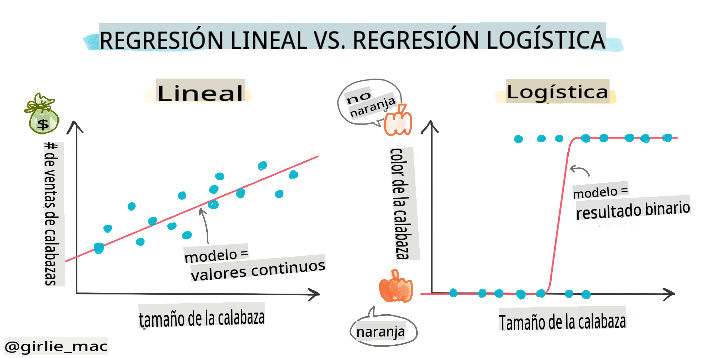
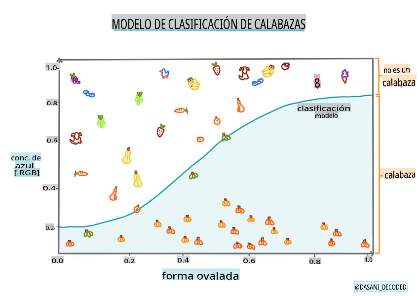
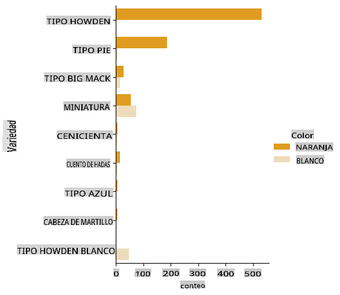
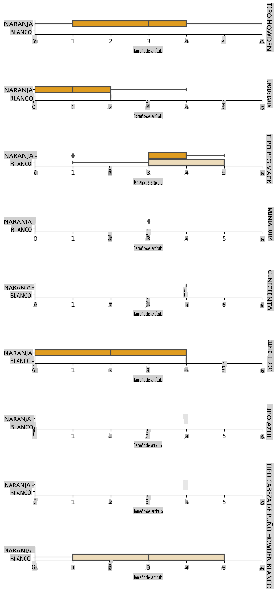
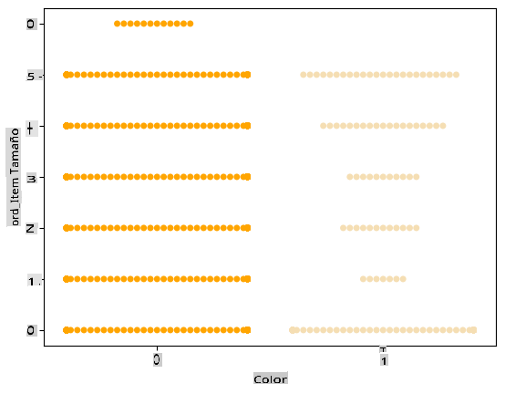
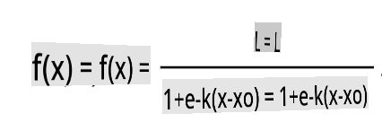
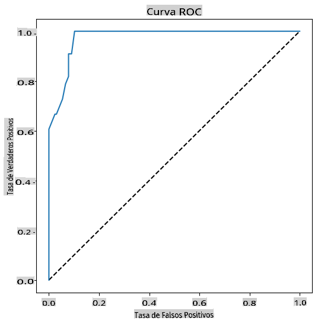

# Regresión logística para predecir categorías



## [Cuestionario previo a la lección](https://gray-sand-07a10f403.1.azurestaticapps.net/quiz/15/)

> ### [¡Esta lección está disponible en R!](../../../../2-Regression/4-Logistic/solution/R/lesson_4.html)

## Introducción

En esta última lección sobre Regresión, una de las técnicas básicas _clásicas_ de ML, echaremos un vistazo a la Regresión Logística. Utilizarías esta técnica para descubrir patrones y predecir categorías binarias. ¿Es este caramelo de chocolate o no? ¿Es esta enfermedad contagiosa o no? ¿Elegirá este cliente este producto o no?

En esta lección, aprenderás:

- Una nueva biblioteca para visualización de datos
- Técnicas para la regresión logística

✅ Profundiza tu comprensión sobre el trabajo con este tipo de regresión en este [módulo de aprendizaje](https://docs.microsoft.com/learn/modules/train-evaluate-classification-models?WT.mc_id=academic-77952-leestott)

## Prerrequisito

Habiendo trabajado con los datos de las calabazas, ahora estamos lo suficientemente familiarizados con ellos para darnos cuenta de que hay una categoría binaria con la que podemos trabajar: `Color`.

Construyamos un modelo de regresión logística para predecir, dado algunas variables, _de qué color es probable que sea una calabaza_ (naranja 🎃 o blanca 👻).

> ¿Por qué estamos hablando de clasificación binaria en una lección sobre regresión? Solo por conveniencia lingüística, ya que la regresión logística es [realmente un método de clasificación](https://scikit-learn.org/stable/modules/linear_model.html#logistic-regression), aunque basado en lo lineal. Aprende sobre otras formas de clasificar datos en el próximo grupo de lecciones.

## Definir la pregunta

Para nuestros propósitos, expresaremos esto como un binario: 'Blanco' o 'No Blanco'. También hay una categoría 'rayada' en nuestro conjunto de datos, pero hay pocos casos de ella, por lo que no la usaremos. Desaparece una vez que eliminamos los valores nulos del conjunto de datos, de todos modos.

> 🎃 Dato curioso, a veces llamamos a las calabazas blancas 'calabazas fantasma'. No son muy fáciles de tallar, por lo que no son tan populares como las naranjas, ¡pero se ven geniales! Así que también podríamos reformular nuestra pregunta como: 'Fantasma' o 'No Fantasma'. 👻

## Sobre la regresión logística

La regresión logística difiere de la regresión lineal, de la que aprendiste anteriormente, en algunos aspectos importantes.

[](https://youtu.be/KpeCT6nEpBY "ML para principiantes - Comprender la Regresión Logística para la Clasificación de Aprendizaje Automático")

> 🎥 Haz clic en la imagen de arriba para una breve descripción en video de la regresión logística.

### Clasificación binaria

La regresión logística no ofrece las mismas características que la regresión lineal. La primera ofrece una predicción sobre una categoría binaria ("blanco o no blanco"), mientras que la segunda es capaz de predecir valores continuos, por ejemplo, dado el origen de una calabaza y el tiempo de cosecha, _cuánto subirá su precio_.


> Infografía por [Dasani Madipalli](https://twitter.com/dasani_decoded)

### Otras clasificaciones

Hay otros tipos de regresión logística, incluyendo la multinomial y la ordinal:

- **Multinomial**, que implica tener más de una categoría - "Naranja, Blanco y Rayada".
- **Ordinal**, que implica categorías ordenadas, útil si quisiéramos ordenar nuestros resultados lógicamente, como nuestras calabazas que están ordenadas por un número finito de tamaños (mini,pequeño,mediano,grande,xl,xxl).


### Las variables NO TIENEN que correlacionar

¿Recuerdas cómo la regresión lineal funcionaba mejor con variables más correlacionadas? La regresión logística es lo opuesto: las variables no tienen que alinearse. Eso funciona para estos datos que tienen correlaciones algo débiles.

### Necesitas muchos datos limpios

La regresión logística dará resultados más precisos si usas más datos; nuestro pequeño conjunto de datos no es óptimo para esta tarea, así que tenlo en cuenta.

[](https://youtu.be/B2X4H9vcXTs "ML para principiantes - Análisis y Preparación de Datos para Regresión Logística")

> 🎥 Haz clic en la imagen de arriba para una breve descripción en video de la preparación de datos para la regresión lineal

✅ Piensa en los tipos de datos que se prestarían bien a la regresión logística

## Ejercicio - limpiar los datos

Primero, limpia un poco los datos, eliminando los valores nulos y seleccionando solo algunas de las columnas:

1. Agrega el siguiente código:

    ```python
  
    columns_to_select = ['City Name','Package','Variety', 'Origin','Item Size', 'Color']
    pumpkins = full_pumpkins.loc[:, columns_to_select]

    pumpkins.dropna(inplace=True)
    ```

    Siempre puedes echar un vistazo a tu nuevo dataframe:

    ```python
    pumpkins.info
    ```

### Visualización - gráfico categórico

Para este momento, ya has cargado el [cuaderno inicial](../../../../2-Regression/4-Logistic/notebook.ipynb) con los datos de las calabazas una vez más y los has limpiado para preservar un conjunto de datos que contiene algunas variables, incluyendo `Color`. Vamos a visualizar el dataframe en el cuaderno utilizando una biblioteca diferente: [Seaborn](https://seaborn.pydata.org/index.html), que está construida sobre Matplotlib que usamos anteriormente.

Seaborn ofrece algunas formas interesantes de visualizar tus datos. Por ejemplo, puedes comparar distribuciones de los datos para cada `Variety` y `Color` en un gráfico categórico.

1. Crea un gráfico de este tipo usando `catplot` function, using our pumpkin data `pumpkins`, y especificando un mapeo de color para cada categoría de calabaza (naranja o blanca):

    ```python
    import seaborn as sns
    
    palette = {
    'ORANGE': 'orange',
    'WHITE': 'wheat',
    }

    sns.catplot(
    data=pumpkins, y="Variety", hue="Color", kind="count",
    palette=palette, 
    )
    ```

    

    Al observar los datos, puedes ver cómo los datos de Color se relacionan con Variety.

    ✅ Dado este gráfico categórico, ¿cuáles son algunas exploraciones interesantes que puedes imaginar?

### Preprocesamiento de datos: codificación de características y etiquetas

Nuestro conjunto de datos de calabazas contiene valores de cadena para todas sus columnas. Trabajar con datos categóricos es intuitivo para los humanos pero no para las máquinas. Los algoritmos de aprendizaje automático funcionan bien con números. Por eso la codificación es un paso muy importante en la fase de preprocesamiento de datos, ya que nos permite convertir datos categóricos en datos numéricos, sin perder información. Una buena codificación lleva a construir un buen modelo.

Para la codificación de características hay dos tipos principales de codificadores:

1. Codificador ordinal: se adapta bien a las variables ordinales, que son variables categóricas donde sus datos siguen un orden lógico, como la columna `Item Size` en nuestro conjunto de datos. Crea un mapeo tal que cada categoría está representada por un número, que es el orden de la categoría en la columna.

    ```python
    from sklearn.preprocessing import OrdinalEncoder

    item_size_categories = [['sml', 'med', 'med-lge', 'lge', 'xlge', 'jbo', 'exjbo']]
    ordinal_features = ['Item Size']
    ordinal_encoder = OrdinalEncoder(categories=item_size_categories)
    ```

2. Codificador categórico: se adapta bien a las variables nominales, que son variables categóricas donde sus datos no siguen un orden lógico, como todas las características diferentes de `Item Size` en nuestro conjunto de datos. Es una codificación de una sola vez, lo que significa que cada categoría está representada por una columna binaria: la variable codificada es igual a 1 si la calabaza pertenece a esa Variety y 0 en caso contrario.

    ```python
    from sklearn.preprocessing import OneHotEncoder

    categorical_features = ['City Name', 'Package', 'Variety', 'Origin']
    categorical_encoder = OneHotEncoder(sparse_output=False)
    ```
Luego, `ColumnTransformer` se utiliza para combinar múltiples codificadores en un solo paso y aplicarlos a las columnas apropiadas.

```python
    from sklearn.compose import ColumnTransformer
    
    ct = ColumnTransformer(transformers=[
        ('ord', ordinal_encoder, ordinal_features),
        ('cat', categorical_encoder, categorical_features)
        ])
    
    ct.set_output(transform='pandas')
    encoded_features = ct.fit_transform(pumpkins)
```
Por otro lado, para codificar la etiqueta, utilizamos la clase `LabelEncoder` de scikit-learn, que es una clase de utilidad para ayudar a normalizar las etiquetas de modo que contengan solo valores entre 0 y n_clases-1 (aquí, 0 y 1).

```python
    from sklearn.preprocessing import LabelEncoder

    label_encoder = LabelEncoder()
    encoded_label = label_encoder.fit_transform(pumpkins['Color'])
```
Una vez que hemos codificado las características y la etiqueta, podemos fusionarlas en un nuevo dataframe `encoded_pumpkins`.

```python
    encoded_pumpkins = encoded_features.assign(Color=encoded_label)
```
✅ ¿Cuáles son las ventajas de usar un codificador ordinal para la columna `Item Size` column?

### Analyse relationships between variables

Now that we have pre-processed our data, we can analyse the relationships between the features and the label to grasp an idea of how well the model will be able to predict the label given the features.
The best way to perform this kind of analysis is plotting the data. We'll be using again the Seaborn `catplot` function, to visualize the relationships between `Item Size`,  `Variety` y `Color` en un gráfico categórico? Para plotear mejor los datos, usaremos la columna codificada `Item Size` column and the unencoded `Variety`.

```python
    palette = {
    'ORANGE': 'orange',
    'WHITE': 'wheat',
    }
    pumpkins['Item Size'] = encoded_pumpkins['ord__Item Size']

    g = sns.catplot(
        data=pumpkins,
        x="Item Size", y="Color", row='Variety',
        kind="box", orient="h",
        sharex=False, margin_titles=True,
        height=1.8, aspect=4, palette=palette,
    )
    g.set(xlabel="Item Size", ylabel="").set(xlim=(0,6))
    g.set_titles(row_template="{row_name}")
```


### Usar un gráfico de enjambre

Dado que Color es una categoría binaria (Blanco o No), necesita 'un [enfoque especializado](https://seaborn.pydata.org/tutorial/categorical.html?highlight=bar) para la visualización'. Hay otras formas de visualizar la relación de esta categoría con otras variables.

Puedes visualizar variables una al lado de la otra con gráficos de Seaborn.

1. Prueba un gráfico de 'enjambre' para mostrar la distribución de valores:

    ```python
    palette = {
    0: 'orange',
    1: 'wheat'
    }
    sns.swarmplot(x="Color", y="ord__Item Size", data=encoded_pumpkins, palette=palette)
    ```

    

**Ten cuidado**: el código anterior puede generar una advertencia, ya que Seaborn no puede representar tal cantidad de puntos de datos en un gráfico de enjambre. Una posible solución es disminuir el tamaño del marcador, utilizando el parámetro 'size'. Sin embargo, ten en cuenta que esto afecta la legibilidad del gráfico.

> **🧮 Muéstrame las matemáticas**
>
> La regresión logística se basa en el concepto de 'máxima verosimilitud' utilizando [funciones sigmoides](https://wikipedia.org/wiki/Sigmoid_function). Una 'Función Sigmoide' en un gráfico se ve como una forma de 'S'. Toma un valor y lo mapea a algún lugar entre 0 y 1. Su curva también se llama 'curva logística'. Su fórmula se ve así:
>
> 
>
> donde el punto medio de la sigmoide se encuentra en el punto 0 de x, L es el valor máximo de la curva, y k es la inclinación de la curva. Si el resultado de la función es mayor a 0.5, la etiqueta en cuestión recibirá la clase '1' de la elección binaria. Si no, se clasificará como '0'.

## Construye tu modelo

Construir un modelo para encontrar estas clasificaciones binarias es sorprendentemente sencillo en Scikit-learn.

[](https://youtu.be/MmZS2otPrQ8 "ML para principiantes - Regresión Logística para la clasificación de datos")

> 🎥 Haz clic en la imagen de arriba para una breve descripción en video de la construcción de un modelo de regresión lineal

1. Selecciona las variables que deseas utilizar en tu modelo de clasificación y divide los conjuntos de entrenamiento y prueba llamando a `train_test_split()`:

    ```python
    from sklearn.model_selection import train_test_split
    
    X = encoded_pumpkins[encoded_pumpkins.columns.difference(['Color'])]
    y = encoded_pumpkins['Color']

    X_train, X_test, y_train, y_test = train_test_split(X, y, test_size=0.2, random_state=0)
    
    ```

2. Ahora puedes entrenar tu modelo, llamando a `fit()` con tus datos de entrenamiento, e imprimir su resultado:

    ```python
    from sklearn.metrics import f1_score, classification_report 
    from sklearn.linear_model import LogisticRegression

    model = LogisticRegression()
    model.fit(X_train, y_train)
    predictions = model.predict(X_test)

    print(classification_report(y_test, predictions))
    print('Predicted labels: ', predictions)
    print('F1-score: ', f1_score(y_test, predictions))
    ```

    Echa un vistazo al puntaje de tu modelo. No está mal, considerando que solo tienes alrededor de 1000 filas de datos:

    ```output
                       precision    recall  f1-score   support
    
                    0       0.94      0.98      0.96       166
                    1       0.85      0.67      0.75        33
    
        accuracy                                0.92       199
        macro avg           0.89      0.82      0.85       199
        weighted avg        0.92      0.92      0.92       199
    
        Predicted labels:  [0 0 0 0 0 0 0 0 0 0 0 0 0 0 0 0 0 0 0 0 1 0 0 1 0 0 0 0 0 0 0 0 1 0 0 0 0
        0 0 0 0 0 1 0 1 0 0 1 0 0 0 0 0 1 0 1 0 1 0 1 0 0 0 0 0 0 0 0 0 0 0 0 0 0
        1 0 0 0 0 0 0 0 1 0 0 0 0 0 0 0 1 0 0 0 0 0 0 0 0 1 0 1 0 0 0 0 0 0 0 1 0
        0 0 0 0 0 0 0 0 0 0 0 0 0 0 0 0 0 0 0 0 0 1 0 0 0 0 0 0 0 0 1 0 0 0 1 1 0
        0 0 0 0 1 0 0 0 0 0 1 0 0 0 0 0 0 0 0 0 0 0 0 0 0 0 0 0 0 0 0 0 0 0 0 0 1
        0 0 0 1 0 0 0 0 0 0 0 0 1 1]
        F1-score:  0.7457627118644068
    ```

## Mejor comprensión mediante una matriz de confusión

Aunque puedes obtener un informe de puntuación [términos](https://scikit-learn.org/stable/modules/generated/sklearn.metrics.classification_report.html?highlight=classification_report#sklearn.metrics.classification_report) imprimiendo los elementos anteriores, podrías entender mejor tu modelo usando una [matriz de confusión](https://scikit-learn.org/stable/modules/model_evaluation.html#confusion-matrix) para ayudarnos a comprender cómo está funcionando el modelo.

> 🎓 Una '[matriz de confusión](https://wikipedia.org/wiki/Confusion_matrix)' (o 'matriz de error') es una tabla que expresa los verdaderos vs. falsos positivos y negativos de tu modelo, evaluando así la precisión de las predicciones.

1. Para usar una métrica de confusión, llama a `confusion_matrix()`:

    ```python
    from sklearn.metrics import confusion_matrix
    confusion_matrix(y_test, predictions)
    ```

    Echa un vistazo a la matriz de confusión de tu modelo:

    ```output
    array([[162,   4],
           [ 11,  22]])
    ```

En Scikit-learn, las filas de las matrices de confusión (eje 0) son etiquetas reales y las columnas (eje 1) son etiquetas predichas.

|       |   0   |   1   |
| :---: | :---: | :---: |
|   0   |  TN   |  FP   |
|   1   |  FN   |  TP   |

¿Qué está pasando aquí? Digamos que nuestro modelo se le pide clasificar calabazas entre dos categorías binarias, categoría 'blanco' y categoría 'no-blanco'.

- Si tu modelo predice una calabaza como no blanca y pertenece a la categoría 'no-blanco' en realidad, lo llamamos un verdadero negativo, mostrado por el número superior izquierdo.
- Si tu modelo predice una calabaza como blanca y pertenece a la categoría 'no-blanco' en realidad, lo llamamos un falso negativo, mostrado por el número inferior izquierdo.
- Si tu modelo predice una calabaza como no blanca y pertenece a la categoría 'blanco' en realidad, lo llamamos un falso positivo, mostrado por el número superior derecho.
- Si tu modelo predice una calabaza como blanca y pertenece a la categoría 'blanco' en realidad, lo llamamos un verdadero positivo, mostrado por el número inferior derecho.

Como habrás adivinado, es preferible tener un mayor número de verdaderos positivos y verdaderos negativos y un menor número de falsos positivos y falsos negativos, lo que implica que el modelo funciona mejor.

¿Cómo se relaciona la matriz de confusión con la precisión y el recall? Recuerda, el informe de clasificación impreso anteriormente mostró precisión (0.85) y recall (0.67).

Precisión = tp / (tp + fp) = 22 / (22 + 4) = 0.8461538461538461

Recall = tp / (tp + fn) = 22 / (22 + 11) = 0.6666666666666666

✅ P: Según la matriz de confusión, ¿cómo le fue al modelo? R: No está mal; hay un buen número de verdaderos negativos pero también algunos falsos negativos.

Volvamos a los términos que vimos anteriormente con la ayuda del mapeo TP/TN y FP/FN de la matriz de confusión:

🎓 Precisión: TP/(TP + FP) La fracción de instancias relevantes entre las instancias recuperadas (por ejemplo, qué etiquetas fueron bien etiquetadas)

🎓 Recall: TP/(TP + FN) La fracción de instancias relevantes que fueron recuperadas, ya sea bien etiquetadas o no

🎓 f1-score: (2 * precisión * recall)/(precisión + recall) Un promedio ponderado de la precisión y el recall, siendo el mejor 1 y el peor 0

🎓 Soporte: El número de ocurrencias de cada etiqueta recuperada

🎓 Exactitud: (TP + TN)/(TP + TN + FP + FN) El porcentaje de etiquetas predichas con precisión para una muestra.

🎓 Promedio Macro: El cálculo de las métricas medias no ponderadas para cada etiqueta, sin tener en cuenta el desequilibrio de las etiquetas.

🎓 Promedio Ponderado: El cálculo de las métricas medias para cada etiqueta, teniendo en cuenta el desequilibrio de las etiquetas ponderándolas por su soporte (el número de instancias verdaderas para cada etiqueta).

✅ ¿Puedes pensar en qué métrica deberías observar si deseas que tu modelo reduzca el número de falsos negativos?

## Visualiza la curva ROC de este modelo

[](https://youtu.be/GApO575jTA0 "ML para principiantes - Analizando el Rendimiento de la Regresión Logística con Curvas ROC")

> 🎥 Haz clic en la imagen de arriba para una breve descripción en video de las curvas ROC

Hagamos una visualización más para ver la llamada curva 'ROC':

```python
from sklearn.metrics import roc_curve, roc_auc_score
import matplotlib
import matplotlib.pyplot as plt
%matplotlib inline

y_scores = model.predict_proba(X_test)
fpr, tpr, thresholds = roc_curve(y_test, y_scores[:,1])

fig = plt.figure(figsize=(6, 6))
plt.plot([0, 1], [0, 1], 'k--')
plt.plot(fpr, tpr)
plt.xlabel('False Positive Rate')
plt.ylabel('True Positive Rate')
plt.title('ROC Curve')
plt.show()
```

Usando Matplotlib, grafica la [Curva Característica Operativa del Receptor](https://scikit-learn.org/stable/auto_examples/model_selection/plot_roc.html?highlight=roc) o ROC del modelo. Las curvas ROC se utilizan a menudo para obtener una vista de la salida de un clasificador en términos de sus verdaderos vs. falsos positivos. "Las curvas ROC generalmente presentan la tasa de verdaderos positivos en el eje Y, y la tasa de falsos positivos en el eje X". Por lo tanto, la inclinación de la curva y el espacio entre la línea del punto medio y la curva importan: deseas una curva que rápidamente se dirija hacia arriba y sobre la línea. En nuestro caso, hay falsos positivos al principio, y luego la línea se dirige hacia arriba y sobre correctamente:



Finalmente, usa la [API `roc_auc_score` de Scikit-learn](https://scikit-learn.org/stable/modules/generated/sklearn.metrics.roc_auc_score.html?highlight=roc_auc#sklearn.metrics.roc_auc_score) para calcular el 'Área Bajo la Curva' (AUC):

```python
auc = roc_auc_score(y_test,y_scores[:,1])
print(auc)
```
El resultado es `0.9749908725812341`. Dado que el AUC varía de 0 a 1, deseas un puntaje alto, ya que un modelo que es 100% correcto en sus predicciones tendrá un AUC de 1; en este caso

**Descargo de responsabilidad**:
Este documento ha sido traducido utilizando servicios de traducción automática basados en inteligencia artificial. Aunque nos esforzamos por lograr precisión, tenga en cuenta que las traducciones automáticas pueden contener errores o inexactitudes. El documento original en su idioma nativo debe considerarse la fuente autorizada. Para información crítica, se recomienda la traducción humana profesional. No nos hacemos responsables de ningún malentendido o interpretación errónea que surja del uso de esta traducción.