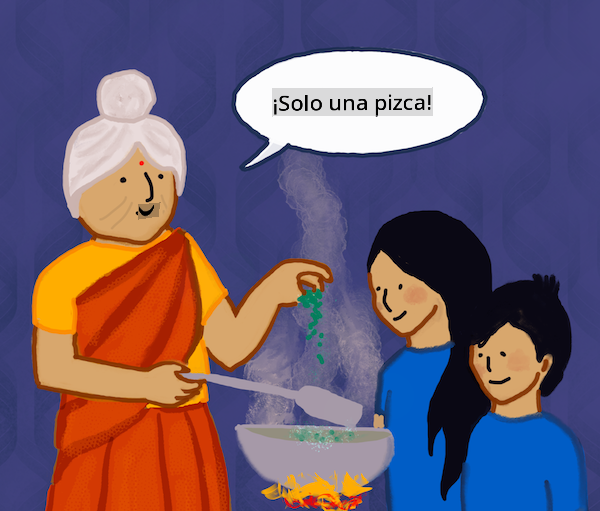
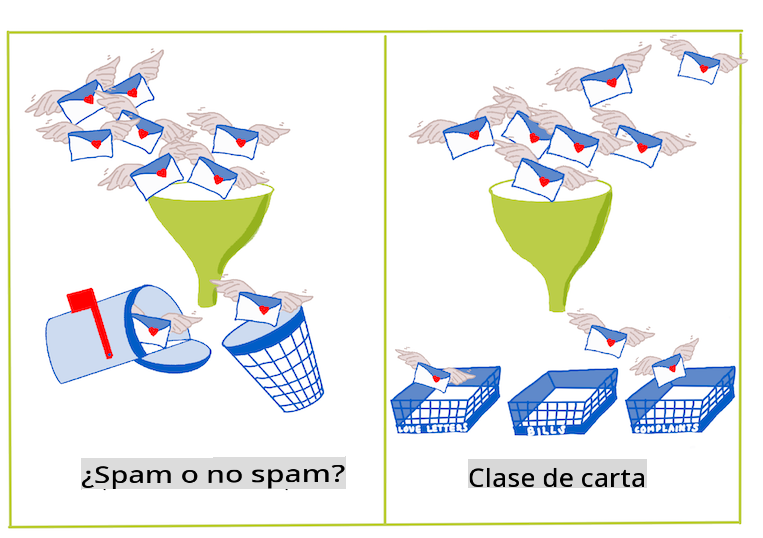
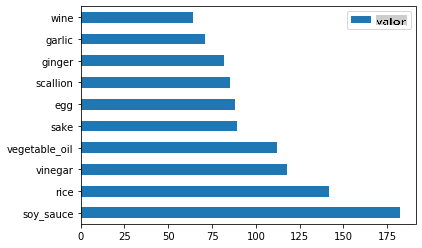
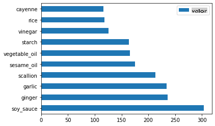
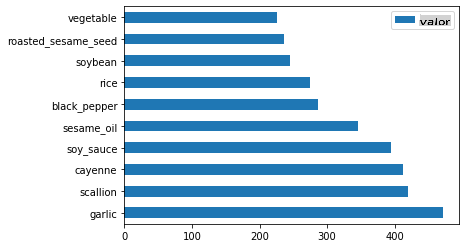

# Introducción a la clasificación

En estas cuatro lecciones, explorarás un enfoque fundamental del aprendizaje automático clásico: la _clasificación_. Recorreremos el uso de varios algoritmos de clasificación con un conjunto de datos sobre todas las brillantes cocinas de Asia e India. ¡Espero que tengas hambre!



> ¡Celebra las cocinas panasiáticas en estas lecciones! Imagen por [Jen Looper](https://twitter.com/jenlooper)

La clasificación es una forma de [aprendizaje supervisado](https://wikipedia.org/wiki/Supervised_learning) que tiene mucho en común con las técnicas de regresión. Si el aprendizaje automático se trata de predecir valores o nombres de cosas usando conjuntos de datos, entonces la clasificación generalmente se divide en dos grupos: _clasificación binaria_ y _clasificación multiclase_.

[](https://youtu.be/eg8DJYwdMyg "Introducción a la clasificación")

> 🎥 Haz clic en la imagen de arriba para ver un video: John Guttag del MIT introduce la clasificación

Recuerda:

- **La regresión lineal** te ayudó a predecir relaciones entre variables y hacer predicciones precisas sobre dónde caería un nuevo punto de datos en relación con esa línea. Por ejemplo, podrías predecir _cuál sería el precio de una calabaza en septiembre vs. diciembre_.
- **La regresión logística** te ayudó a descubrir "categorías binarias": a este precio, _¿esta calabaza es naranja o no-naranja_?

La clasificación utiliza varios algoritmos para determinar otras formas de determinar la etiqueta o clase de un punto de datos. Trabajemos con estos datos de cocina para ver si, observando un grupo de ingredientes, podemos determinar su cocina de origen.

## [Cuestionario previo a la lección](https://gray-sand-07a10f403.1.azurestaticapps.net/quiz/19/)

> ### [¡Esta lección está disponible en R!](../../../../4-Classification/1-Introduction/solution/R/lesson_10.html)

### Introducción

La clasificación es una de las actividades fundamentales del investigador en aprendizaje automático y del científico de datos. Desde la clasificación básica de un valor binario ("¿es este correo electrónico spam o no?"), hasta la clasificación y segmentación de imágenes complejas usando visión por computadora, siempre es útil poder clasificar datos en clases y hacer preguntas sobre ellos.

Para expresar el proceso de una manera más científica, tu método de clasificación crea un modelo predictivo que te permite mapear la relación entre variables de entrada y variables de salida.



> Problemas binarios vs. multiclase para que los algoritmos de clasificación manejen. Infografía por [Jen Looper](https://twitter.com/jenlooper)

Antes de comenzar el proceso de limpiar nuestros datos, visualizarlos y prepararlos para nuestras tareas de aprendizaje automático, aprendamos un poco sobre las diversas formas en que se puede utilizar el aprendizaje automático para clasificar datos.

Derivado de [estadísticas](https://wikipedia.org/wiki/Statistical_classification), la clasificación usando aprendizaje automático clásico utiliza características, como `smoker`, `weight`, y `age` para determinar _la probabilidad de desarrollar X enfermedad_. Como técnica de aprendizaje supervisado similar a los ejercicios de regresión que realizaste anteriormente, tus datos están etiquetados y los algoritmos de aprendizaje automático usan esas etiquetas para clasificar y predecir clases (o 'características') de un conjunto de datos y asignarlas a un grupo o resultado.

✅ Tómate un momento para imaginar un conjunto de datos sobre cocinas. ¿Qué podría responder un modelo multiclase? ¿Qué podría responder un modelo binario? ¿Qué pasaría si quisieras determinar si una cocina dada es probable que use fenogreco? ¿Y si quisieras ver si, dado un regalo de una bolsa de supermercado llena de anís estrellado, alcachofas, coliflor y rábano picante, podrías crear un plato típico indio?

[](https://youtu.be/GuTeDbaNoEU "Cestas misteriosas locas")

> 🎥 Haz clic en la imagen de arriba para ver un video. Toda la premisa del programa 'Chopped' es la 'cesta misteriosa' donde los chefs tienen que hacer algún plato con una elección aleatoria de ingredientes. ¡Seguramente un modelo de aprendizaje automático habría ayudado!

## Hola 'clasificador'

La pregunta que queremos hacer sobre este conjunto de datos de cocina es en realidad una **pregunta multiclase**, ya que tenemos varias cocinas nacionales potenciales con las que trabajar. Dado un lote de ingredientes, ¿a cuál de estas muchas clases se ajustarán los datos?

Scikit-learn ofrece varios algoritmos diferentes para clasificar datos, dependiendo del tipo de problema que quieras resolver. En las próximas dos lecciones, aprenderás sobre varios de estos algoritmos.

## Ejercicio - limpiar y equilibrar tus datos

La primera tarea a mano, antes de comenzar este proyecto, es limpiar y **equilibrar** tus datos para obtener mejores resultados. Comienza con el archivo _notebook.ipynb_ en la raíz de esta carpeta.

Lo primero que debes instalar es [imblearn](https://imbalanced-learn.org/stable/). Este es un paquete de Scikit-learn que te permitirá equilibrar mejor los datos (aprenderás más sobre esta tarea en un momento).

1. Para instalar `imblearn`, ejecuta `pip install`, de la siguiente manera:

    ```python
    pip install imblearn
    ```

1. Importa los paquetes que necesitas para importar tus datos y visualizarlos, también importa `SMOTE` de `imblearn`.

    ```python
    import pandas as pd
    import matplotlib.pyplot as plt
    import matplotlib as mpl
    import numpy as np
    from imblearn.over_sampling import SMOTE
    ```

    Ahora estás listo para importar los datos.

1. La siguiente tarea será importar los datos:

    ```python
    df  = pd.read_csv('../data/cuisines.csv')
    ```

   Usando `read_csv()` will read the content of the csv file _cusines.csv_ and place it in the variable `df`.

1. Revisa la forma de los datos:

    ```python
    df.head()
    ```

   Las primeras cinco filas se ven así:

    ```output
    |     | Unnamed: 0 | cuisine | almond | angelica | anise | anise_seed | apple | apple_brandy | apricot | armagnac | ... | whiskey | white_bread | white_wine | whole_grain_wheat_flour | wine | wood | yam | yeast | yogurt | zucchini |
    | --- | ---------- | ------- | ------ | -------- | ----- | ---------- | ----- | ------------ | ------- | -------- | --- | ------- | ----------- | ---------- | ----------------------- | ---- | ---- | --- | ----- | ------ | -------- |
    | 0   | 65         | indian  | 0      | 0        | 0     | 0          | 0     | 0            | 0       | 0        | ... | 0       | 0           | 0          | 0                       | 0    | 0    | 0   | 0     | 0      | 0        |
    | 1   | 66         | indian  | 1      | 0        | 0     | 0          | 0     | 0            | 0       | 0        | ... | 0       | 0           | 0          | 0                       | 0    | 0    | 0   | 0     | 0      | 0        |
    | 2   | 67         | indian  | 0      | 0        | 0     | 0          | 0     | 0            | 0       | 0        | ... | 0       | 0           | 0          | 0                       | 0    | 0    | 0   | 0     | 0      | 0        |
    | 3   | 68         | indian  | 0      | 0        | 0     | 0          | 0     | 0            | 0       | 0        | ... | 0       | 0           | 0          | 0                       | 0    | 0    | 0   | 0     | 0      | 0        |
    | 4   | 69         | indian  | 0      | 0        | 0     | 0          | 0     | 0            | 0       | 0        | ... | 0       | 0           | 0          | 0                       | 0    | 0    | 0   | 0     | 1      | 0        |
    ```

1. Obtén información sobre estos datos llamando a `info()`:

    ```python
    df.info()
    ```

    Tu salida se parece a:

    ```output
    <class 'pandas.core.frame.DataFrame'>
    RangeIndex: 2448 entries, 0 to 2447
    Columns: 385 entries, Unnamed: 0 to zucchini
    dtypes: int64(384), object(1)
    memory usage: 7.2+ MB
    ```

## Ejercicio - aprendiendo sobre cocinas

Ahora el trabajo empieza a volverse más interesante. Descubramos la distribución de los datos, por cocina.

1. Grafica los datos como barras llamando a `barh()`:

    ```python
    df.cuisine.value_counts().plot.barh()
    ```

    

    Hay un número finito de cocinas, pero la distribución de los datos es desigual. ¡Puedes arreglar eso! Antes de hacerlo, explora un poco más.

1. Descubre cuántos datos hay disponibles por cocina e imprímelos:

    ```python
    thai_df = df[(df.cuisine == "thai")]
    japanese_df = df[(df.cuisine == "japanese")]
    chinese_df = df[(df.cuisine == "chinese")]
    indian_df = df[(df.cuisine == "indian")]
    korean_df = df[(df.cuisine == "korean")]
    
    print(f'thai df: {thai_df.shape}')
    print(f'japanese df: {japanese_df.shape}')
    print(f'chinese df: {chinese_df.shape}')
    print(f'indian df: {indian_df.shape}')
    print(f'korean df: {korean_df.shape}')
    ```

    la salida se ve así:

    ```output
    thai df: (289, 385)
    japanese df: (320, 385)
    chinese df: (442, 385)
    indian df: (598, 385)
    korean df: (799, 385)
    ```

## Descubriendo ingredientes

Ahora puedes profundizar en los datos y aprender cuáles son los ingredientes típicos por cocina. Deberías limpiar los datos recurrentes que crean confusión entre cocinas, así que aprendamos sobre este problema.

1. Crea una función `create_ingredient()` en Python para crear un dataframe de ingredientes. Esta función comenzará eliminando una columna no útil y clasificando los ingredientes por su cantidad:

    ```python
    def create_ingredient_df(df):
        ingredient_df = df.T.drop(['cuisine','Unnamed: 0']).sum(axis=1).to_frame('value')
        ingredient_df = ingredient_df[(ingredient_df.T != 0).any()]
        ingredient_df = ingredient_df.sort_values(by='value', ascending=False,
        inplace=False)
        return ingredient_df
    ```

   Ahora puedes usar esa función para obtener una idea de los diez ingredientes más populares por cocina.

1. Llama a `create_ingredient()` and plot it calling `barh()`:

    ```python
    thai_ingredient_df = create_ingredient_df(thai_df)
    thai_ingredient_df.head(10).plot.barh()
    ```

    

1. Haz lo mismo para los datos japoneses:

    ```python
    japanese_ingredient_df = create_ingredient_df(japanese_df)
    japanese_ingredient_df.head(10).plot.barh()
    ```

    

1. Ahora para los ingredientes chinos:

    ```python
    chinese_ingredient_df = create_ingredient_df(chinese_df)
    chinese_ingredient_df.head(10).plot.barh()
    ```

    

1. Grafica los ingredientes indios:

    ```python
    indian_ingredient_df = create_ingredient_df(indian_df)
    indian_ingredient_df.head(10).plot.barh()
    ```

    

1. Finalmente, grafica los ingredientes coreanos:

    ```python
    korean_ingredient_df = create_ingredient_df(korean_df)
    korean_ingredient_df.head(10).plot.barh()
    ```

    

1. Ahora, elimina los ingredientes más comunes que crean confusión entre cocinas distintas, llamando a `drop()`: 

   ¡A todos les encanta el arroz, el ajo y el jengibre!

    ```python
    feature_df= df.drop(['cuisine','Unnamed: 0','rice','garlic','ginger'], axis=1)
    labels_df = df.cuisine #.unique()
    feature_df.head()
    ```

## Equilibrar el conjunto de datos

Ahora que has limpiado los datos, usa [SMOTE](https://imbalanced-learn.org/dev/references/generated/imblearn.over_sampling.SMOTE.html) - "Técnica de Sobremuestreo de Minorías Sintéticas" - para equilibrarlos.

1. Llama a `fit_resample()`, esta estrategia genera nuevas muestras mediante interpolación.

    ```python
    oversample = SMOTE()
    transformed_feature_df, transformed_label_df = oversample.fit_resample(feature_df, labels_df)
    ```

    Al equilibrar tus datos, tendrás mejores resultados al clasificarlos. Piensa en una clasificación binaria. Si la mayoría de tus datos son de una clase, un modelo de aprendizaje automático va a predecir esa clase con más frecuencia, simplemente porque hay más datos para ella. El equilibrado de los datos toma cualquier dato sesgado y ayuda a eliminar este desequilibrio.

1. Ahora puedes revisar el número de etiquetas por ingrediente:

    ```python
    print(f'new label count: {transformed_label_df.value_counts()}')
    print(f'old label count: {df.cuisine.value_counts()}')
    ```

    Tu salida se ve así:

    ```output
    new label count: korean      799
    chinese     799
    indian      799
    japanese    799
    thai        799
    Name: cuisine, dtype: int64
    old label count: korean      799
    indian      598
    chinese     442
    japanese    320
    thai        289
    Name: cuisine, dtype: int64
    ```

    Los datos están bien y limpios, equilibrados y muy deliciosos!

1. El último paso es guardar tus datos equilibrados, incluyendo etiquetas y características, en un nuevo dataframe que se pueda exportar a un archivo:

    ```python
    transformed_df = pd.concat([transformed_label_df,transformed_feature_df],axis=1, join='outer')
    ```

1. Puedes echar un último vistazo a los datos usando `transformed_df.head()` and `transformed_df.info()`. Guarda una copia de estos datos para usarlos en futuras lecciones:

    ```python
    transformed_df.head()
    transformed_df.info()
    transformed_df.to_csv("../data/cleaned_cuisines.csv")
    ```

    Este nuevo CSV se puede encontrar ahora en la carpeta de datos raíz.

---

## 🚀Desafío

Este plan de estudios contiene varios conjuntos de datos interesantes. Explora las carpetas `data` y ve si alguna contiene conjuntos de datos que serían apropiados para clasificación binaria o multiclase. ¿Qué preguntas harías sobre este conjunto de datos?

## [Cuestionario posterior a la lección](https://gray-sand-07a10f403.1.azurestaticapps.net/quiz/20/)

## Revisión y autoestudio

Explora la API de SMOTE. ¿Para qué casos de uso es más adecuado? ¿Qué problemas resuelve?

## Tarea

[Explora métodos de clasificación](assignment.md)

**Descargo de responsabilidad**:
Este documento ha sido traducido utilizando servicios de traducción automatizada por IA. Aunque nos esforzamos por lograr precisión, tenga en cuenta que las traducciones automáticas pueden contener errores o inexactitudes. El documento original en su idioma nativo debe considerarse la fuente autorizada. Para información crítica, se recomienda la traducción profesional humana. No somos responsables de ningún malentendido o interpretación errónea que surja del uso de esta traducción.