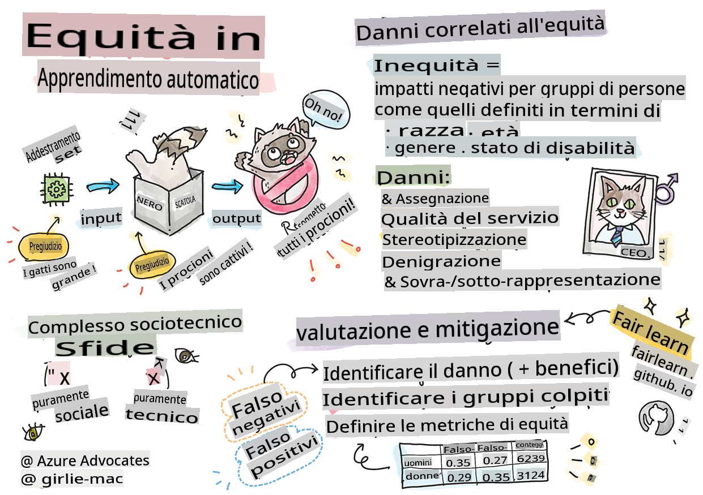
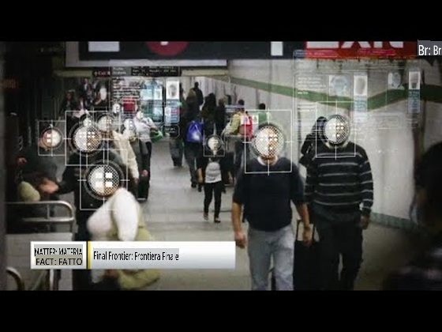

# Costruire soluzioni di Machine Learning con AI responsabile

> Sketchnote di [Tomomi Imura](https://www.twitter.com/girlie_mac)

## [Quiz pre-lezione](https://gray-sand-07a10f403.1.azurestaticapps.net/quiz/5/)

## Introduzione

In questo curriculum, inizierai a scoprire come il machine learning può influenzare e sta influenzando le nostre vite quotidiane. Anche ora, sistemi e modelli sono coinvolti in compiti decisionali quotidiani, come diagnosi sanitarie, approvazioni di prestiti o rilevamento di frodi. Pertanto, è importante che questi modelli funzionino bene per fornire risultati affidabili. Come qualsiasi applicazione software, i sistemi AI possono non soddisfare le aspettative o avere un esito indesiderato. Ecco perché è essenziale essere in grado di comprendere e spiegare il comportamento di un modello AI.

Immagina cosa può accadere quando i dati che usi per costruire questi modelli mancano di determinate demografie, come razza, genere, opinione politica, religione, o rappresentano queste demografie in modo sproporzionato. E se l'output del modello fosse interpretato in modo da favorire alcune demografie? Quali sono le conseguenze per l'applicazione? Inoltre, cosa succede quando il modello ha un esito negativo e danneggia le persone? Chi è responsabile del comportamento dei sistemi AI? Queste sono alcune delle domande che esploreremo in questo curriculum.

In questa lezione, tu:

- Aumenterai la consapevolezza dell'importanza dell'equità nel machine learning e dei danni correlati all'equità.
- Diventerai familiare con la pratica di esplorare casi anomali e scenari insoliti per garantire affidabilità e sicurezza.
- Capirai la necessità di potenziare tutti progettando sistemi inclusivi.
- Esplorerai quanto sia vitale proteggere la privacy e la sicurezza dei dati e delle persone.
- Vedrai l'importanza di avere un approccio a scatola trasparente per spiegare il comportamento dei modelli AI.
- Sarai consapevole di come la responsabilità sia essenziale per costruire fiducia nei sistemi AI.

## Prerequisito

Come prerequisito, segui il percorso di apprendimento "Principi di AI Responsabile" e guarda il video qui sotto sull'argomento:

Scopri di più sull'AI Responsabile seguendo questo [Percorso di Apprendimento](https://docs.microsoft.com/learn/modules/responsible-ai-principles/?WT.mc_id=academic-77952-leestott)

> 🎥 Clicca sull'immagine sopra per un video: Approccio di Microsoft all'AI Responsabile

## Equità

I sistemi AI dovrebbero trattare tutti in modo equo ed evitare di influenzare gruppi simili di persone in modi diversi. Ad esempio, quando i sistemi AI forniscono indicazioni su trattamenti medici, domande di prestito o occupazione, dovrebbero fare le stesse raccomandazioni a tutti con sintomi simili, circostanze finanziarie o qualifiche professionali. Ognuno di noi come esseri umani porta con sé pregiudizi ereditati che influenzano le nostre decisioni e azioni. Questi pregiudizi possono essere evidenti nei dati che usiamo per addestrare i sistemi AI. Tale manipolazione può a volte accadere involontariamente. È spesso difficile sapere consapevolmente quando stai introducendo pregiudizi nei dati.

**"Ingiustizia"** comprende impatti negativi, o "danni", per un gruppo di persone, come quelli definiti in termini di razza, genere, età o stato di disabilità. I principali danni correlati all'equità possono essere classificati come:

- **Allocazione**, se un genere o un'etnia, ad esempio, è favorita rispetto a un'altra.
- **Qualità del servizio**. Se addestri i dati per uno scenario specifico ma la realtà è molto più complessa, porta a un servizio di scarsa qualità. Ad esempio, un dispenser di sapone per le mani che non riesce a rilevare persone con pelle scura. [Riferimento](https://gizmodo.com/why-cant-this-soap-dispenser-identify-dark-skin-1797931773)
- **Denigrazione**. Criticare e etichettare ingiustamente qualcosa o qualcuno. Ad esempio, una tecnologia di etichettatura delle immagini ha infamemente etichettato erroneamente immagini di persone con pelle scura come gorilla.
- **Sovra- o sotto-rappresentazione**. L'idea è che un certo gruppo non sia visto in una certa professione, e qualsiasi servizio o funzione che continua a promuovere ciò sta contribuendo al danno.
- **Stereotipizzazione**. Associare un determinato gruppo con attributi preassegnati. Ad esempio, un sistema di traduzione linguistica tra inglese e turco può avere inesattezze dovute a parole con associazioni stereotipate al genere.

> traduzione in turco

> traduzione di ritorno in inglese

Quando progettiamo e testiamo sistemi AI, dobbiamo garantire che l'AI sia equa e non programmata per prendere decisioni pregiudizievoli o discriminatorie, che anche gli esseri umani sono proibiti dal prendere. Garantire l'equità nell'AI e nel machine learning rimane una sfida socio-tecnica complessa.

### Affidabilità e sicurezza

Per costruire fiducia, i sistemi AI devono essere affidabili, sicuri e coerenti in condizioni normali e inattese. È importante sapere come si comporteranno i sistemi AI in una varietà di situazioni, specialmente quando sono anomali. Quando si costruiscono soluzioni AI, è necessario concentrarsi notevolmente su come gestire una vasta gamma di circostanze che le soluzioni AI incontreranno. Ad esempio, un'auto a guida autonoma deve mettere la sicurezza delle persone come priorità assoluta. Di conseguenza, l'AI che alimenta l'auto deve considerare tutti gli scenari possibili che l'auto potrebbe incontrare come notte, temporali o bufere di neve, bambini che attraversano la strada, animali domestici, lavori stradali ecc. Quanto bene un sistema AI può gestire una vasta gamma di condizioni in modo affidabile e sicuro riflette il livello di anticipazione che lo scienziato dei dati o lo sviluppatore AI ha considerato durante la progettazione o il test del sistema.

> [🎥 Clicca qui per un video: ](https://www.microsoft.com/videoplayer/embed/RE4vvIl)

### Inclusività

I sistemi AI dovrebbero essere progettati per coinvolgere e potenziare tutti. Quando progettano e implementano sistemi AI, gli scienziati dei dati e gli sviluppatori AI identificano e affrontano potenziali barriere nel sistema che potrebbero escludere involontariamente le persone. Ad esempio, ci sono 1 miliardo di persone con disabilità in tutto il mondo. Con l'avanzamento dell'AI, possono accedere a una vasta gamma di informazioni e opportunità più facilmente nella loro vita quotidiana. Affrontando le barriere, si creano opportunità per innovare e sviluppare prodotti AI con migliori esperienze che beneficiano tutti.

> [🎥 Clicca qui per un video: inclusività nell'AI](https://www.microsoft.com/videoplayer/embed/RE4vl9v)

### Sicurezza e privacy

I sistemi AI devono essere sicuri e rispettare la privacy delle persone. Le persone hanno meno fiducia nei sistemi che mettono a rischio la loro privacy, le loro informazioni o le loro vite. Quando addestriamo modelli di machine learning, ci affidiamo ai dati per ottenere i migliori risultati. Facendo ciò, è necessario considerare l'origine dei dati e la loro integrità. Ad esempio, i dati sono stati inviati dagli utenti o sono pubblicamente disponibili? Inoltre, mentre si lavora con i dati, è cruciale sviluppare sistemi AI che possano proteggere le informazioni riservate e resistere agli attacchi. Con l'aumento della diffusione dell'AI, proteggere la privacy e garantire la sicurezza delle informazioni personali e aziendali sta diventando sempre più critico e complesso. Le questioni di privacy e sicurezza dei dati richiedono un'attenzione particolarmente attenta per l'AI perché l'accesso ai dati è essenziale per i sistemi AI per fare previsioni e decisioni accurate e informate sulle persone.

> [🎥 Clicca qui per un video: sicurezza nell'AI](https://www.microsoft.com/videoplayer/embed/RE4voJF)

- Come industria, abbiamo fatto significativi progressi in Privacy e Sicurezza, alimentati significativamente da regolamenti come il GDPR (Regolamento Generale sulla Protezione dei Dati).
- Tuttavia, con i sistemi AI dobbiamo riconoscere la tensione tra la necessità di più dati personali per rendere i sistemi più personali ed efficaci - e la privacy.
- Proprio come con la nascita dei computer connessi a Internet, stiamo anche vedendo un enorme aumento del numero di problemi di sicurezza legati all'AI.
- Allo stesso tempo, abbiamo visto l'AI essere utilizzata per migliorare la sicurezza. Ad esempio, la maggior parte degli scanner antivirus moderni sono guidati da euristiche AI.
- Dobbiamo garantire che i nostri processi di Data Science si armonizzino con le più recenti pratiche di privacy e sicurezza.

### Trasparenza

I sistemi AI devono essere comprensibili. Una parte cruciale della trasparenza è spiegare il comportamento dei sistemi AI e dei loro componenti. Migliorare la comprensione dei sistemi AI richiede che gli stakeholder comprendano come e perché funzionano in modo che possano identificare potenziali problemi di prestazione, preoccupazioni sulla sicurezza e sulla privacy, pregiudizi, pratiche esclusive o risultati indesiderati. Crediamo anche che coloro che usano i sistemi AI debbano essere onesti e trasparenti su quando, perché e come scelgono di utilizzarli. Così come i limiti dei sistemi che utilizzano. Ad esempio, se una banca utilizza un sistema AI per supportare le sue decisioni di prestito ai consumatori, è importante esaminare i risultati e capire quali dati influenzano le raccomandazioni del sistema. I governi stanno iniziando a regolamentare l'AI in vari settori, quindi gli scienziati dei dati e le organizzazioni devono spiegare se un sistema AI soddisfa i requisiti normativi, specialmente quando c'è un risultato indesiderato.

> [🎥 Clicca qui per un video: trasparenza nell'AI](https://www.microsoft.com/videoplayer/embed/RE4voJF)

- Poiché i sistemi AI sono così complessi, è difficile capire come funzionano e interpretare i risultati.
- Questa mancanza di comprensione influisce sul modo in cui questi sistemi sono gestiti, operazionalizzati e documentati.
- Questa mancanza di comprensione influisce soprattutto sulle decisioni prese utilizzando i risultati prodotti da questi sistemi.

### Responsabilità

Le persone che progettano e implementano sistemi AI devono essere responsabili del modo in cui i loro sistemi operano. La necessità di responsabilità è particolarmente cruciale con tecnologie sensibili come il riconoscimento facciale. Recentemente, c'è stata una crescente domanda di tecnologia di riconoscimento facciale, soprattutto da parte delle organizzazioni di applicazione della legge che vedono il potenziale della tecnologia in usi come la ricerca di bambini scomparsi. Tuttavia, queste tecnologie potrebbero potenzialmente essere utilizzate da un governo per mettere a rischio le libertà fondamentali dei cittadini, ad esempio, consentendo la sorveglianza continua di individui specifici. Pertanto, gli scienziati dei dati e le organizzazioni devono essere responsabili di come il loro sistema AI impatta sugli individui o sulla società.

> 🎥 Clicca sull'immagine sopra per un video: Avvertimenti sulla Sorveglianza di Massa Attraverso il Riconoscimento Facciale

Alla fine, una delle domande più grandi per la nostra generazione, come la prima generazione che sta portando l'AI nella società, è come garantire che i computer rimangano responsabili verso le persone e come garantire che le persone che progettano i computer rimangano responsabili verso tutti gli altri.

## Valutazione dell'impatto

Prima di addestrare un modello di machine learning, è importante condurre una valutazione dell'impatto per comprendere lo scopo del sistema AI; qual è l'uso previsto; dove sarà implementato; e chi interagirà con il sistema. Questi sono utili per il revisore o i tester che valutano il sistema per sapere quali fattori considerare quando identificano potenziali rischi e conseguenze attese.

Le seguenti sono aree di interesse quando si conduce una valutazione dell'impatto:

* **Impatto negativo sugli individui**. Essere consapevoli di eventuali restrizioni o requisiti, uso non supportato o eventuali limitazioni note che ostacolano le prestazioni del sistema è vitale per garantire che il sistema non venga utilizzato in modo da causare danni agli individui.
* **Requisiti dei dati**. Capire come e dove il sistema utilizzerà i dati consente ai revisori di esplorare eventuali requisiti dei dati di cui bisogna essere consapevoli (ad esempio, regolamenti sui dati GDPR o HIPPA). Inoltre, esaminare se la fonte o la quantità di dati è sufficiente per l'addestramento.
* **Sintesi dell'impatto**. Raccogliere un elenco di potenziali danni che potrebbero derivare dall'uso del sistema. Durante tutto il ciclo di vita del ML, verificare se i problemi identificati sono mitigati o affrontati.
* **Obiettivi applicabili** per ciascuno dei sei principi fondamentali. Valutare se gli obiettivi di ciascun principio sono soddisfatti e se ci sono eventuali lacune.

## Debugging con AI responsabile

Simile al debugging di un'applicazione software, il debugging di un sistema AI è un processo necessario per identificare e risolvere i problemi nel sistema. Ci sono molti fattori che potrebbero influenzare un modello che non performa come previsto o in modo responsabile. La maggior parte delle metriche di prestazione dei modelli tradizionali sono aggregati quantitativi delle prestazioni di un modello, che non sono sufficienti per analizzare come un modello viola i principi dell'AI responsabile. Inoltre, un modello di machine learning è una scatola nera che rende difficile capire cosa guida il suo risultato o fornire spiegazioni quando commette un errore. Più avanti in questo corso, impareremo come utilizzare la dashboard AI Responsabile per aiutare a fare debugging dei sistemi AI. La dashboard fornisce uno strumento olistico per gli scienziati dei dati e gli sviluppatori AI per eseguire:

* **Analisi degli errori**. Per identificare la distribuzione degli errori del modello che può influenzare l'equità o l'affidabilità del sistema.
* **Panoramica del modello**. Per scoprire dove ci sono disparità nelle prestazioni del modello tra i vari gruppi di dati.
* **Analisi dei dati**. Per comprendere la distribuzione dei dati e identificare eventuali pregiudizi nei dati che potrebbero portare a problemi di equità, inclusività e affidabilità.
* **Interpretabilità del modello**. Per capire cosa influenza o influenza le previsioni del modello. Questo aiuta a spiegare il comportamento del modello, che è importante per la trasparenza e la responsabilità.

## 🚀 Sfida

Per prevenire i danni fin dall'inizio, dovremmo:

- avere una diversità di background e prospettive tra le persone che lavorano sui sistemi
- investire in dataset che riflettano la diversità della nostra società
- sviluppare metodi migliori lungo tutto il ciclo di vita del machine learning per rilevare e correggere l'AI responsabile quando si verifica

Pensa a scenari reali in cui l'inaffidabilità di un modello è evidente nella costruzione e nell'uso del modello. Cos'altro dovremmo considerare?

## [Quiz post-lezione](https://gray-sand-07a10f403.1.azurestaticapps.net/quiz/6/)
## Revisione e Autoapprendimento

In questa lezione, hai appreso alcune basi dei concetti di equità e iniquità nel machine learning.

Guarda questo workshop per approfondire gli argomenti:

- Alla ricerca di AI responsabile: portare i principi in pratica di Besmira Nushi, Mehrnoosh Sameki e Amit Sharma

> 🎥 Clicca sull'immagine sopra per un video: RAI Toolbox: Un framework open-source per costruire AI responsabile di Besmira Nushi, Mehrnoosh Sameki e Amit Sharma

Leggi anche:

- Centro risorse RAI di Microsoft: [Risorse di AI Responsabile – Microsoft AI](https://www.microsoft.com/ai/responsible-ai-resources?activetab=pivot1%3aprimaryr4)

- Gruppo di ricerca FATE di Microsoft: [FATE: Equità, Responsabilità, Trasparenza ed Etica nell'AI - Microsoft Research](https://www.microsoft.com/research/theme/fate/)

RAI Toolbox:

- [Repository GitHub di Responsible AI Toolbox](https://github.com/microsoft/responsible-ai

**Disclaimer**:
Questo documento è stato tradotto utilizzando servizi di traduzione automatica basati su AI. Anche se ci sforziamo di garantire l'accuratezza, si prega di essere consapevoli che le traduzioni automatiche possono contenere errori o imprecisioni. Il documento originale nella sua lingua nativa dovrebbe essere considerato la fonte autorevole. Per informazioni critiche, si raccomanda una traduzione umana professionale. Non siamo responsabili per eventuali malintesi o interpretazioni errate derivanti dall'uso di questa traduzione.