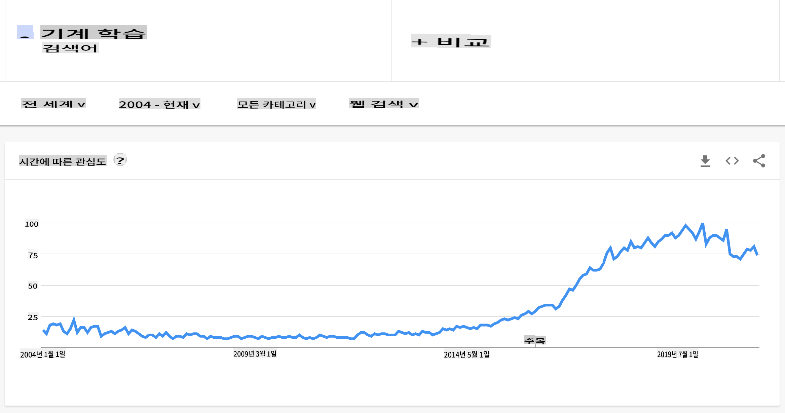
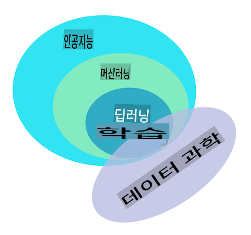

# 머신 러닝 소개

## [강의 전 퀴즈](https://gray-sand-07a10f403.1.azurestaticapps.net/quiz/1/)

---

> 🎥 위 이미지를 클릭하면 이 강의를 다루는 짧은 비디오를 볼 수 있습니다.

초보자를 위한 클래식 머신 러닝 강좌에 오신 것을 환영합니다! 이 주제가 처음이든, 특정 영역을 복습하고 싶은 경험 있는 ML 실무자든, 함께 하게 되어 기쁩니다! 여러분의 ML 학습을 위한 친근한 출발점을 만들고자 하며, [피드백](https://github.com/microsoft/ML-For-Beginners/discussions)을 평가하고, 응답하고, 반영하는 것을 기쁘게 생각합니다.

> 🎥 위 이미지를 클릭하면 MIT의 John Guttag이 머신 러닝을 소개하는 비디오를 볼 수 있습니다.

---
## 머신 러닝 시작하기

이 커리큘럼을 시작하기 전에, 노트북을 로컬에서 실행할 수 있도록 컴퓨터를 설정해야 합니다.

- **이 비디오들로 컴퓨터 설정하기**. 시스템에 [파이썬 설치 방법](https://youtu.be/CXZYvNRIAKM)과 개발을 위한 [텍스트 편집기 설정](https://youtu.be/EU8eayHWoZg)을 배우기 위해 다음 링크를 사용하세요.
- **파이썬 배우기**. 데이터 과학자에게 유용한 프로그래밍 언어인 [파이썬](https://docs.microsoft.com/learn/paths/python-language/?WT.mc_id=academic-77952-leestott)에 대한 기본적인 이해를 갖추는 것이 좋습니다.
- **Node.js와 자바스크립트 배우기**. 이 과정에서 웹 앱을 구축할 때 몇 번 자바스크립트를 사용하므로 [node](https://nodejs.org)와 [npm](https://www.npmjs.com/)을 설치하고, 파이썬과 자바스크립트 개발을 위한 [Visual Studio Code](https://code.visualstudio.com/)도 설치해야 합니다.
- **GitHub 계정 만들기**. [GitHub](https://github.com)에서 우리를 찾았으니 이미 계정이 있을 수도 있지만, 그렇지 않다면 계정을 만들고 이 커리큘럼을 포크하여 사용하세요. (별표도 주시면 좋겠습니다 😊)
- **Scikit-learn 탐색하기**. 이 강의에서 참조하는 ML 라이브러리 세트인 [Scikit-learn](https://scikit-learn.org/stable/user_guide.html)에 익숙해지세요.

---
## 머신 러닝이란 무엇인가?

'머신 러닝'이라는 용어는 오늘날 가장 인기 있고 자주 사용되는 용어 중 하나입니다. 어떤 분야에서 일하든 기술에 대해 어느 정도 익숙하다면 이 용어를 한 번쯤은 들어봤을 가능성이 큽니다. 그러나 머신 러닝의 메커니즘은 대부분의 사람들에게는 신비롭습니다. 머신 러닝 초보자에게는 이 주제가 때로는 벅차게 느껴질 수 있습니다. 따라서 머신 러닝이 실제로 무엇인지 이해하고, 실용적인 예제를 통해 단계적으로 배우는 것이 중요합니다.

---
## 과대광고 곡선

> 구글 트렌드는 '머신 러닝' 용어의 최근 '과대광고 곡선'을 보여줍니다.

---
## 신비로운 우주

우리는 매혹적인 신비로 가득 찬 우주에 살고 있습니다. Stephen Hawking, Albert Einstein 등 많은 위대한 과학자들은 우리 주변 세계의 신비를 밝혀내기 위해 평생을 바쳤습니다. 이것이 학습의 인간 조건입니다: 인간의 아이는 새로운 것을 배우고 성인이 될 때까지 해마다 자신의 세계 구조를 발견합니다.

---
## 아이의 두뇌

아이의 두뇌와 감각은 주변 환경의 사실을 인식하고 점차 삶의 숨겨진 패턴을 배우며, 이러한 패턴을 식별하는 논리적 규칙을 만들도록 도와줍니다. 인간 두뇌의 학습 과정은 인간을 이 세상의 가장 정교한 생명체로 만듭니다. 숨겨진 패턴을 발견하고 그 패턴을 혁신함으로써 끊임없이 배우는 것은 우리가 평생 동안 더 나아질 수 있게 합니다. 이 학습 능력과 진화 능력은 [뇌 가소성](https://www.simplypsychology.org/brain-plasticity.html)이라는 개념과 관련이 있습니다. 표면적으로, 인간 두뇌의 학습 과정과 머신 러닝 개념 사이에 몇 가지 동기적인 유사점을 그릴 수 있습니다.

---
## 인간 두뇌

[인간 두뇌](https://www.livescience.com/29365-human-brain.html)는 실제 세계에서 정보를 인식하고, 인식된 정보를 처리하며, 합리적인 결정을 내리고, 상황에 따라 특정 행동을 수행합니다. 이를 지능적으로 행동한다고 합니다. 지능적 행동 과정을 기계에 프로그램하는 것을 인공지능(AI)이라고 합니다.

---
## 몇 가지 용어

용어가 혼동될 수 있지만, 머신 러닝(ML)은 인공지능의 중요한 하위 집합입니다. **ML은 특수한 알고리즘을 사용하여 의미 있는 정보를 발견하고 인식된 데이터에서 숨겨진 패턴을 찾아 합리적 의사 결정 과정을 확립하는 것에 중점을 둡니다**.

---
## AI, ML, 딥 러닝

> AI, ML, 딥 러닝, 데이터 과학 간의 관계를 보여주는 다이어그램. [Jen Looper](https://twitter.com/jenlooper)의 인포그래픽으로 [이 그래픽](https://softwareengineering.stackexchange.com/questions/366996/distinction-between-ai-ml-neural-networks-deep-learning-and-data-mining)에서 영감을 받았습니다.

---
## 다룰 개념

이 커리큘럼에서는 초보자가 반드시 알아야 할 머신 러닝의 핵심 개념만 다룰 것입니다. 우리는 많은 학생들이 기초를 배우기 위해 사용하는 훌륭한 라이브러리인 Scikit-learn을 주로 사용하여 '클래식 머신 러닝'을 다룹니다. 인공지능이나 딥 러닝의 더 넓은 개념을 이해하려면 머신 러닝에 대한 강력한 기초 지식이 필수적이므로, 여기에서 이를 제공하고자 합니다.

---
## 이 강의에서 배우게 될 것:

- 머신 러닝의 핵심 개념
- ML의 역사
- ML과 공정성
- 회귀 ML 기술
- 분류 ML 기술
- 군집화 ML 기술
- 자연어 처리 ML 기술
- 시계열 예측 ML 기술
- 강화 학습
- ML의 실제 응용

---
## 다루지 않을 내용

- 딥 러닝
- 신경망
- AI

더 나은 학습 경험을 위해, 신경망, '딥 러닝' - 신경망을 사용한 다층 모델 구축 - 및 AI의 복잡성을 피할 것입니다. 이는 다른 커리큘럼에서 다룰 예정입니다. 또한 이 더 큰 분야에 집중하기 위해 다가오는 데이터 과학 커리큘럼도 제공할 것입니다.

---
## 왜 머신 러닝을 공부해야 하는가?

시스템 관점에서 머신 러닝은 데이터에서 숨겨진 패턴을 학습하여 지능적인 결정을 내리는 자동화 시스템을 만드는 것으로 정의됩니다.

이 동기는 인간 두뇌가 외부 세계에서 인식한 데이터를 기반으로 특정한 것을 배우는 방식에서 느슨하게 영감을 받았습니다.

✅ 비즈니스가 하드 코딩된 규칙 기반 엔진을 만드는 대신 머신 러닝 전략을 사용하려는 이유를 잠시 생각해 보세요.

---
## 머신 러닝의 응용

머신 러닝의 응용은 이제 거의 모든 곳에 있으며, 우리 사회에서 스마트폰, 연결된 장치 및 기타 시스템에 의해 생성되는 데이터만큼이나 널리 퍼져 있습니다. 최첨단 머신 러닝 알고리즘의 엄청난 잠재력을 고려할 때, 연구자들은 다차원적이고 다학문적인 실제 문제를 해결하는 데 그 능력을 탐구해 왔으며, 긍정적인 결과를 얻고 있습니다.

---
## 적용된 ML의 예

**다양한 방식으로 머신 러닝을 사용할 수 있습니다**:

- 환자의 병력이나 보고서에서 질병의 가능성을 예측합니다.
- 기상 데이터를 활용하여 기상 이벤트를 예측합니다.
- 텍스트의 감정을 이해합니다.
- 가짜 뉴스를 감지하여 선전의 확산을 막습니다.

금융, 경제학, 지구과학, 우주 탐사, 생물 의공학, 인지 과학, 심지어 인문학 분야에서도 머신 러닝을 적용하여 그들의 분야에서 어려운 데이터 처리 문제를 해결하고 있습니다.

---
## 결론

머신 러닝은 실제 데이터나 생성된 데이터에서 의미 있는 통찰을 찾아 패턴 발견 과정을 자동화합니다. 비즈니스, 건강, 금융 응용 등에서 매우 가치가 높다는 것이 입증되었습니다.

가까운 미래에는 머신 러닝의 기본을 이해하는 것이 그 광범위한 채택으로 인해 어느 분야에서든 필수가 될 것입니다.

---
# 🚀 도전

[Excalidraw](https://excalidraw.com/)와 같은 온라인 앱이나 종이를 사용하여 AI, ML, 딥 러닝, 데이터 과학 간의 차이에 대한 이해를 스케치하세요. 각 기술이 해결하기에 좋은 문제에 대한 아이디어를 추가하세요.

# [강의 후 퀴즈](https://gray-sand-07a10f403.1.azurestaticapps.net/quiz/2/)

---
# 복습 및 자기 학습

클라우드에서 ML 알고리즘을 사용하는 방법에 대해 자세히 알아보려면 이 [학습 경로](https://docs.microsoft.com/learn/paths/create-no-code-predictive-models-azure-machine-learning/?WT.mc_id=academic-77952-leestott)를 따라가세요.

ML의 기본에 대한 [학습 경로](https://docs.microsoft.com/learn/modules/introduction-to-machine-learning/?WT.mc_id=academic-77952-leestott)를 따라가세요.

---
# 과제

[시작하기](assignment.md)

**면책 조항**:
이 문서는 기계 기반 AI 번역 서비스를 사용하여 번역되었습니다. 정확성을 위해 노력하지만 자동 번역에는 오류나 부정확성이 포함될 수 있습니다. 원본 문서가 권위 있는 출처로 간주되어야 합니다. 중요한 정보의 경우 전문적인 인간 번역을 권장합니다. 이 번역 사용으로 인해 발생하는 오해나 오역에 대해서는 책임을 지지 않습니다.