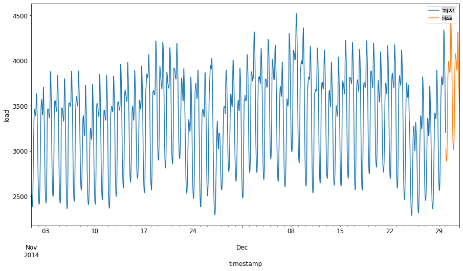
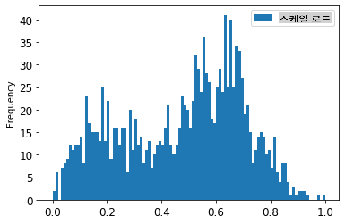

# ARIMA를 사용한 시계열 예측

이전 강의에서는 시계열 예측에 대해 조금 배웠고, 일정 기간 동안 전력 부하의 변동을 보여주는 데이터를 로드했습니다.

[](https://youtu.be/IUSk-YDau10 "Introduction to ARIMA")

> 🎥 위 이미지를 클릭하면 ARIMA 모델에 대한 간략한 소개 영상을 볼 수 있습니다. 예제는 R로 작성되었지만, 개념은 보편적입니다.

## [강의 전 퀴즈](https://gray-sand-07a10f403.1.azurestaticapps.net/quiz/43/)

## 소개

이 강의에서는 [ARIMA: *A*uto*R*egressive *I*ntegrated *M*oving *A*verage](https://wikipedia.org/wiki/Autoregressive_integrated_moving_average) 모델을 구축하는 특정 방법을 배웁니다. ARIMA 모델은 특히 [비정상성](https://wikipedia.org/wiki/Stationary_process)을 보이는 데이터를 적합하게 만들기에 적합합니다.

## 일반 개념

ARIMA를 사용하기 위해 알아야 할 몇 가지 개념이 있습니다:

- 🎓 **정상성**. 통계적 맥락에서 정상성은 시간이 지나도 분포가 변하지 않는 데이터를 의미합니다. 비정상 데이터는 분석하기 위해 변환이 필요합니다. 예를 들어 계절성은 데이터에 변동을 일으킬 수 있으며, '계절 차분' 과정을 통해 제거할 수 있습니다.

- 🎓 **[차분](https://wikipedia.org/wiki/Autoregressive_integrated_moving_average#Differencing)**. 차분은 비정상 데이터를 정상 데이터로 변환하는 과정을 의미합니다. "차분은 시계열의 수준 변화를 제거하여 추세와 계절성을 제거하고 시계열의 평균을 안정화시킵니다." [Shixiong et al의 논문](https://arxiv.org/abs/1904.07632)

## 시계열의 맥락에서 ARIMA

ARIMA의 구성 요소를 분석하여 시계열 모델을 구축하고 예측하는 데 어떻게 도움이 되는지 알아보겠습니다.

- **AR - 자기회귀**. 자기회귀 모델은 이름에서 알 수 있듯이 데이터를 '뒤돌아보며' 이전 값을 분석하고 가정을 합니다. 이러한 이전 값을 '시차'라고 합니다. 예를 들어 월별 연필 판매 데이터를 생각해보세요. 각 월의 판매 총액은 데이터셋에서 '진화 변수'로 간주됩니다. 이 모델은 "관심 있는 진화 변수가 자신의 시차(즉, 이전) 값에 대해 회귀되는" 방식으로 구축됩니다. [wikipedia](https://wikipedia.org/wiki/Autoregressive_integrated_moving_average)

- **I - 통합**. 'ARMA' 모델과 달리 ARIMA의 'I'는 *[통합](https://wikipedia.org/wiki/Order_of_integration)* 측면을 의미합니다. 데이터를 비정상성을 제거하기 위해 차분 단계를 적용하여 '통합'합니다.

- **MA - 이동 평균**. [이동 평균](https://wikipedia.org/wiki/Moving-average_model) 모델의 측면은 현재와 과거 시차 값을 관찰하여 결정되는 출력 변수를 의미합니다.

결론: ARIMA는 시계열 데이터를 가능한 한 밀접하게 적합하게 만드는 모델을 구축하는 데 사용됩니다.

## 실습 - ARIMA 모델 구축

이 강의의 [_/working_](https://github.com/microsoft/ML-For-Beginners/tree/main/7-TimeSeries/2-ARIMA/working) 폴더를 열고 [_notebook.ipynb_](https://github.com/microsoft/ML-For-Beginners/blob/main/7-TimeSeries/2-ARIMA/working/notebook.ipynb) 파일을 찾으세요.

1. 노트북을 실행하여 ARIMA 모델에 필요한 `statsmodels` Python 라이브러리를 로드하세요.

1. 필요한 라이브러리를 로드하세요.

1. 이제 데이터를 시각화하는 데 유용한 몇 가지 추가 라이브러리를 로드하세요:

    ```python
    import os
    import warnings
    import matplotlib.pyplot as plt
    import numpy as np
    import pandas as pd
    import datetime as dt
    import math

    from pandas.plotting import autocorrelation_plot
    from statsmodels.tsa.statespace.sarimax import SARIMAX
    from sklearn.preprocessing import MinMaxScaler
    from common.utils import load_data, mape
    from IPython.display import Image

    %matplotlib inline
    pd.options.display.float_format = '{:,.2f}'.format
    np.set_printoptions(precision=2)
    warnings.filterwarnings("ignore") # specify to ignore warning messages
    ```

1. `/data/energy.csv` 파일에서 데이터를 Pandas 데이터프레임으로 로드하고 확인하세요:

    ```python
    energy = load_data('./data')[['load']]
    energy.head(10)
    ```

1. 2012년 1월부터 2014년 12월까지의 모든 에너지 데이터를 시각화하세요. 이전 강의에서 본 데이터이므로 놀라운 점은 없을 것입니다:

    ```python
    energy.plot(y='load', subplots=True, figsize=(15, 8), fontsize=12)
    plt.xlabel('timestamp', fontsize=12)
    plt.ylabel('load', fontsize=12)
    plt.show()
    ```

    이제 모델을 구축해봅시다!

### 학습 및 테스트 데이터셋 생성

이제 데이터를 로드했으므로 학습 세트와 테스트 세트로 분리할 수 있습니다. 학습 세트로 모델을 학습시킬 것입니다. 모델 학습이 완료되면 테스트 세트를 사용하여 정확도를 평가합니다. 모델이 미래 기간의 정보를 얻지 않도록 학습 세트와 테스트 세트가 시간적으로 구분되도록 해야 합니다.

1. 2014년 9월 1일부터 10월 31일까지의 2개월 기간을 학습 세트로 할당합니다. 테스트 세트는 2014년 11월 1일부터 12월 31일까지의 2개월 기간을 포함합니다:

    ```python
    train_start_dt = '2014-11-01 00:00:00'
    test_start_dt = '2014-12-30 00:00:00'
    ```

    이 데이터는 일일 에너지 소비를 반영하므로 강한 계절 패턴이 있지만, 소비는 최근 일과 가장 유사합니다.

1. 차이를 시각화하세요:

    ```python
    energy[(energy.index < test_start_dt) & (energy.index >= train_start_dt)][['load']].rename(columns={'load':'train'}) \
        .join(energy[test_start_dt:][['load']].rename(columns={'load':'test'}), how='outer') \
        .plot(y=['train', 'test'], figsize=(15, 8), fontsize=12)
    plt.xlabel('timestamp', fontsize=12)
    plt.ylabel('load', fontsize=12)
    plt.show()
    ```

    

    따라서 데이터를 학습하는 데 상대적으로 작은 시간 창을 사용하는 것이 충분해야 합니다.

    > Note: ARIMA 모델을 맞추기 위해 사용하는 함수는 맞추는 동안 샘플 내 검증을 사용하므로 검증 데이터를 생략합니다.

### 학습을 위한 데이터 준비

이제 데이터를 필터링하고 스케일링하여 학습을 위한 데이터를 준비해야 합니다. 필요한 기간과 열만 포함하도록 원본 데이터셋을 필터링하고 데이터를 0과 1 사이의 범위로 투영하도록 스케일링합니다.

1. 위에서 언급한 기간별로 데이터셋을 필터링하고 필요한 'load' 열과 날짜만 포함하도록 필터링하세요:

    ```python
    train = energy.copy()[(energy.index >= train_start_dt) & (energy.index < test_start_dt)][['load']]
    test = energy.copy()[energy.index >= test_start_dt][['load']]

    print('Training data shape: ', train.shape)
    print('Test data shape: ', test.shape)
    ```

    데이터의 형태를 확인할 수 있습니다:

    ```output
    Training data shape:  (1416, 1)
    Test data shape:  (48, 1)
    ```

1. 데이터를 (0, 1) 범위로 스케일링하세요.

    ```python
    scaler = MinMaxScaler()
    train['load'] = scaler.fit_transform(train)
    train.head(10)
    ```

1. 원본 데이터와 스케일링된 데이터를 시각화하세요:

    ```python
    energy[(energy.index >= train_start_dt) & (energy.index < test_start_dt)][['load']].rename(columns={'load':'original load'}).plot.hist(bins=100, fontsize=12)
    train.rename(columns={'load':'scaled load'}).plot.hist(bins=100, fontsize=12)
    plt.show()
    ```

    

    > 원본 데이터

    

    > 스케일링된 데이터

1. 이제 스케일링된 데이터를 조정했으므로 테스트 데이터를 스케일링할 수 있습니다:

    ```python
    test['load'] = scaler.transform(test)
    test.head()
    ```

### ARIMA 구현

이제 ARIMA를 구현할 시간입니다! 이전에 설치한 `statsmodels` 라이브러리를 사용할 것입니다.

몇 가지 단계를 따라야 합니다

   1. `SARIMAX()` and passing in the model parameters: p, d, and q parameters, and P, D, and Q parameters.
   2. Prepare the model for the training data by calling the fit() function.
   3. Make predictions calling the `forecast()` function and specifying the number of steps (the `horizon`) to forecast.

> 🎓 What are all these parameters for? In an ARIMA model there are 3 parameters that are used to help model the major aspects of a time series: seasonality, trend, and noise. These parameters are:

`p`: the parameter associated with the auto-regressive aspect of the model, which incorporates *past* values.
`d`: the parameter associated with the integrated part of the model, which affects the amount of *differencing* (🎓 remember differencing 👆?) to apply to a time series.
`q`: the parameter associated with the moving-average part of the model.

> Note: If your data has a seasonal aspect - which this one does - , we use a seasonal ARIMA model (SARIMA). In that case you need to use another set of parameters: `P`, `D`, and `Q` which describe the same associations as `p`, `d`, and `q`를 호출하여 모델을 정의하세요.

1. 선호하는 horizon 값을 설정하세요. 3시간을 시도해봅시다:

    ```python
    # Specify the number of steps to forecast ahead
    HORIZON = 3
    print('Forecasting horizon:', HORIZON, 'hours')
    ```

    ARIMA 모델의 매개변수에 대한 최적의 값을 선택하는 것은 주관적이고 시간이 많이 걸릴 수 있습니다. `auto_arima()` function from the [`pyramid` 라이브러리](https://alkaline-ml.com/pmdarima/0.9.0/modules/generated/pyramid.arima.auto_arima.html)를 사용하는 것을 고려할 수 있습니다.

1. 지금은 좋은 모델을 찾기 위해 몇 가지 수동 선택을 시도해봅시다.

    ```python
    order = (4, 1, 0)
    seasonal_order = (1, 1, 0, 24)

    model = SARIMAX(endog=train, order=order, seasonal_order=seasonal_order)
    results = model.fit()

    print(results.summary())
    ```

    결과 테이블이 출력됩니다.

첫 번째 모델을 구축했습니다! 이제 이를 평가할 방법을 찾아야 합니다.

### 모델 평가

모델을 평가하기 위해 이른바 `walk forward` 검증을 수행할 수 있습니다. 실제로 시계열 모델은 새로운 데이터가 제공될 때마다 다시 학습됩니다. 이를 통해 모델은 각 시간 단계에서 최상의 예측을 할 수 있습니다.

이 기술을 사용하여 시계열의 시작부터 학습 데이터 세트로 모델을 학습합니다. 그런 다음 다음 시간 단계에 대한 예측을 수행합니다. 예측은 알려진 값과 비교됩니다. 그런 다음 학습 세트는 알려진 값을 포함하도록 확장되고 과정이 반복됩니다.

> Note: 더 효율적인 학습을 위해 학습 세트 창을 고정하는 것이 좋습니다. 매번 학습 세트에 새로운 관찰값을 추가할 때, 세트의 시작 부분에서 관찰값을 제거합니다.

이 과정은 모델이 실제로 어떻게 성능을 발휘할지에 대한 더 견고한 추정을 제공합니다. 그러나 많은 모델을 생성하는 계산 비용이 발생합니다. 데이터가 작거나 모델이 간단하면 허용되지만, 규모가 커지면 문제가 될 수 있습니다.

Walk-forward 검증은 시계열 모델 평가의 황금 표준이며, 자신의 프로젝트에 권장됩니다.

1. 먼저 각 HORIZON 단계에 대한 테스트 데이터 포인트를 생성합니다.

    ```python
    test_shifted = test.copy()

    for t in range(1, HORIZON+1):
        test_shifted['load+'+str(t)] = test_shifted['load'].shift(-t, freq='H')

    test_shifted = test_shifted.dropna(how='any')
    test_shifted.head(5)
    ```

    |            |          | load | load+1 | load+2 |
    | ---------- | -------- | ---- | ------ | ------ |
    | 2014-12-30 | 00:00:00 | 0.33 | 0.29   | 0.27   |
    | 2014-12-30 | 01:00:00 | 0.29 | 0.27   | 0.27   |
    | 2014-12-30 | 02:00:00 | 0.27 | 0.27   | 0.30   |
    | 2014-12-30 | 03:00:00 | 0.27 | 0.30   | 0.41   |
    | 2014-12-30 | 04:00:00 | 0.30 | 0.41   | 0.57   |

    데이터는 horizon 포인트에 따라 수평으로 이동됩니다.

1. 테스트 데이터의 크기만큼의 루프에서 이 슬라이딩 윈도우 접근법을 사용하여 예측을 수행합니다:

    ```python
    %%time
    training_window = 720 # dedicate 30 days (720 hours) for training

    train_ts = train['load']
    test_ts = test_shifted

    history = [x for x in train_ts]
    history = history[(-training_window):]

    predictions = list()

    order = (2, 1, 0)
    seasonal_order = (1, 1, 0, 24)

    for t in range(test_ts.shape[0]):
        model = SARIMAX(endog=history, order=order, seasonal_order=seasonal_order)
        model_fit = model.fit()
        yhat = model_fit.forecast(steps = HORIZON)
        predictions.append(yhat)
        obs = list(test_ts.iloc[t])
        # move the training window
        history.append(obs[0])
        history.pop(0)
        print(test_ts.index[t])
        print(t+1, ': predicted =', yhat, 'expected =', obs)
    ```

    학습 과정을 지켜볼 수 있습니다:

    ```output
    2014-12-30 00:00:00
    1 : predicted = [0.32 0.29 0.28] expected = [0.32945389435989236, 0.2900626678603402, 0.2739480752014323]

    2014-12-30 01:00:00
    2 : predicted = [0.3  0.29 0.3 ] expected = [0.2900626678603402, 0.2739480752014323, 0.26812891674127126]

    2014-12-30 02:00:00
    3 : predicted = [0.27 0.28 0.32] expected = [0.2739480752014323, 0.26812891674127126, 0.3025962399283795]
    ```

1. 실제 부하와 예측을 비교합니다:

    ```python
    eval_df = pd.DataFrame(predictions, columns=['t+'+str(t) for t in range(1, HORIZON+1)])
    eval_df['timestamp'] = test.index[0:len(test.index)-HORIZON+1]
    eval_df = pd.melt(eval_df, id_vars='timestamp', value_name='prediction', var_name='h')
    eval_df['actual'] = np.array(np.transpose(test_ts)).ravel()
    eval_df[['prediction', 'actual']] = scaler.inverse_transform(eval_df[['prediction', 'actual']])
    eval_df.head()
    ```

    출력
    |     |            | timestamp | h   | prediction | actual   |
    | --- | ---------- | --------- | --- | ---------- | -------- |
    | 0   | 2014-12-30 | 00:00:00  | t+1 | 3,008.74   | 3,023.00 |
    | 1   | 2014-12-30 | 01:00:00  | t+1 | 2,955.53   | 2,935.00 |
    | 2   | 2014-12-30 | 02:00:00  | t+1 | 2,900.17   | 2,899.00 |
    | 3   | 2014-12-30 | 03:00:00  | t+1 | 2,917.69   | 2,886.00 |
    | 4   | 2014-12-30 | 04:00:00  | t+1 | 2,946.99   | 2,963.00 |

    시간별 데이터의 예측을 실제 부하와 비교해보세요. 얼마나 정확한가요?

### 모델 정확도 확인

모든 예측에 대해 평균 절대 백분율 오차(MAPE)를 테스트하여 모델의 정확도를 확인하세요.

> **🧮 수학 보여줘**
>
> 
>
>  [MAPE](https://www.linkedin.com/pulse/what-mape-mad-msd-time-series-allameh-statistics/)는 위의 공식으로 정의된 비율로 예측 정확도를 보여줍니다. 실제<sub>t</sub>와 예측<sub>t</sub>의 차이는 실제<sub>t</sub>로 나뉩니다. "이 계산의 절대값은 시간의 모든 예측 지점에 대해 합산되고 맞춘 지점 수 n으로 나뉩니다." [wikipedia](https://wikipedia.org/wiki/Mean_absolute_percentage_error)

1. 코드를 통해 공식을 표현하세요:

    ```python
    if(HORIZON > 1):
        eval_df['APE'] = (eval_df['prediction'] - eval_df['actual']).abs() / eval_df['actual']
        print(eval_df.groupby('h')['APE'].mean())
    ```

1. 한 단계의 MAPE를 계산하세요:

    ```python
    print('One step forecast MAPE: ', (mape(eval_df[eval_df['h'] == 't+1']['prediction'], eval_df[eval_df['h'] == 't+1']['actual']))*100, '%')
    ```

    한 단계 예측 MAPE:  0.5570581332313952 %

1. 다중 단계 예측 MAPE를 출력하세요:

    ```python
    print('Multi-step forecast MAPE: ', mape(eval_df['prediction'], eval_df['actual'])*100, '%')
    ```

    ```output
    Multi-step forecast MAPE:  1.1460048657704118 %
    ```

    낮은 숫자가 좋습니다: 예측이 10의 MAPE를 가지면 10%만큼 벗어난 것입니다.

1. 그러나 항상 그렇듯이, 이러한 정확도 측정을 시각적으로 보는 것이 더 쉽습니다. 따라서 이를 시각화해봅시다:

    ```python
     if(HORIZON == 1):
        ## Plotting single step forecast
        eval_df.plot(x='timestamp', y=['actual', 'prediction'], style=['r', 'b'], figsize=(15, 8))

    else:
        ## Plotting multi step forecast
        plot_df = eval_df[(eval_df.h=='t+1')][['timestamp', 'actual']]
        for t in range(1, HORIZON+1):
            plot_df['t+'+str(t)] = eval_df[(eval_df.h=='t+'+str(t))]['prediction'].values

        fig = plt.figure(figsize=(15, 8))
        ax = plt.plot(plot_df['timestamp'], plot_df['actual'], color='red', linewidth=4.0)
        ax = fig.add_subplot(111)
        for t in range(1, HORIZON+1):
            x = plot_df['timestamp'][(t-1):]
            y = plot_df['t+'+str(t)][0:len(x)]
            ax.plot(x, y, color='blue', linewidth=4*math.pow(.9,t), alpha=math.pow(0.8,t))

        ax.legend(loc='best')

    plt.xlabel('timestamp', fontsize=12)
    plt.ylabel('load', fontsize=12)
    plt.show()
    ```

    

🏆 매우 좋은 정확도를 보여주는 멋진 플롯입니다. 잘 했습니다!

---

## 🚀도전

시계열 모델의 정확도를 테스트하는 방법을 조사해보세요. 이 강의에서는 MAPE를 다루지만, 사용할 수 있는 다른 방법이 있을까요? 이를 연구하고 주석을 달아보세요. [여기](https://otexts.com/fpp2/accuracy.html)에서 도움이 되는 문서를 찾을 수 있습니다.

## [강의 후 퀴즈](https://gray-sand-07a10f403.1.azurestaticapps.net/quiz/44/)

## 복습 및 자습

이 강의에서는 ARIMA를 사용한 시계열 예측의 기본 사항만 다룹니다. [이 저장소](https://microsoft.github.io/forecasting/)와 다양한 모델 유형을 탐색하여 시계열 모델을 구축하는 다른 방법을 배우는 데 시간을 할애하세요.

## 과제

[새로운 ARIMA 모델](assignment.md)

**면책 조항**:
이 문서는 기계 기반 AI 번역 서비스를 사용하여 번역되었습니다. 정확성을 위해 노력하고 있지만, 자동 번역에는 오류나 부정확성이 있을 수 있음을 유의하시기 바랍니다. 원어로 작성된 원본 문서를 권위 있는 자료로 간주해야 합니다. 중요한 정보에 대해서는 전문적인 인간 번역을 권장합니다. 이 번역 사용으로 인해 발생하는 오해나 오역에 대해서는 책임을 지지 않습니다.