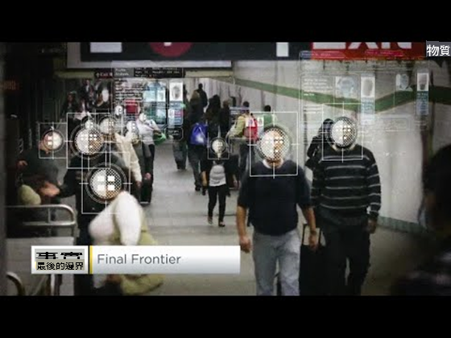

# Construire des solutions d'apprentissage automatique avec une IA responsable

> Sketchnote par [Tomomi Imura](https://www.twitter.com/girlie_mac)

## [Quiz pré-conférence](https://gray-sand-07a10f403.1.azurestaticapps.net/quiz/5/)

## Introduction

Dans ce programme, vous allez commencer à découvrir comment l'apprentissage automatique peut et impacte notre vie quotidienne. Même maintenant, des systèmes et des modèles sont impliqués dans des tâches de prise de décision quotidiennes, telles que les diagnostics de santé, les approbations de prêts ou la détection de fraudes. Il est donc important que ces modèles fonctionnent bien pour fournir des résultats fiables. Tout comme toute application logicielle, les systèmes d'IA peuvent ne pas répondre aux attentes ou avoir un résultat indésirable. C'est pourquoi il est essentiel de comprendre et d'expliquer le comportement d'un modèle d'IA.

Imaginez ce qui peut se passer lorsque les données que vous utilisez pour construire ces modèles manquent de certaines démographies, telles que la race, le genre, l'opinion politique, la religion, ou représentent de manière disproportionnée ces démographies. Que se passe-t-il lorsque la sortie du modèle est interprétée comme favorisant un certain groupe démographique ? Quelle est la conséquence pour l'application ? De plus, que se passe-t-il lorsque le modèle a un résultat négatif et nuit aux personnes ? Qui est responsable du comportement des systèmes d'IA ? Ce sont quelques-unes des questions que nous allons explorer dans ce programme.

Dans cette leçon, vous allez :

- Prendre conscience de l'importance de l'équité dans l'apprentissage automatique et des préjudices liés à l'équité.
- Vous familiariser avec la pratique de l'exploration des valeurs aberrantes et des scénarios inhabituels pour garantir la fiabilité et la sécurité.
- Comprendre la nécessité d'habiliter tout le monde en concevant des systèmes inclusifs.
- Explorer à quel point il est vital de protéger la vie privée et la sécurité des données et des personnes.
- Voir l'importance d'avoir une approche en boîte de verre pour expliquer le comportement des modèles d'IA.
- Être conscient de la façon dont la responsabilité est essentielle pour instaurer la confiance dans les systèmes d'IA.

## Prérequis

Comme prérequis, veuillez suivre le parcours d'apprentissage "Principes de l'IA responsable" et regarder la vidéo ci-dessous sur le sujet :

En savoir plus sur l'IA responsable en suivant ce [Parcours d'apprentissage](https://docs.microsoft.com/learn/modules/responsible-ai-principles/?WT.mc_id=academic-77952-leestott)

> 🎥 Cliquez sur l'image ci-dessus pour une vidéo : Approche de Microsoft en matière d'IA responsable

## Équité

Les systèmes d'IA doivent traiter tout le monde de manière équitable et éviter d'affecter des groupes de personnes similaires de manière différente. Par exemple, lorsque les systèmes d'IA fournissent des recommandations sur des traitements médicaux, des demandes de prêt ou des emplois, ils doivent faire les mêmes recommandations à tous ceux qui ont des symptômes, des circonstances financières ou des qualifications professionnelles similaires. Chacun de nous, en tant qu'humain, porte des biais hérités qui influencent nos décisions et nos actions. Ces biais peuvent être évidents dans les données que nous utilisons pour former des systèmes d'IA. Une telle manipulation peut parfois se produire sans intention. Il est souvent difficile de savoir consciemment quand vous introduisez un biais dans les données.

**“L'inéquité”** englobe les impacts négatifs, ou “préjudices”, pour un groupe de personnes, tels que ceux définis en termes de race, de genre, d'âge ou de statut de handicap. Les principaux préjudices liés à l'équité peuvent être classés comme suit :

- **Allocation**, si un genre ou une ethnie est favorisé par rapport à un autre.
- **Qualité du service**. Si vous formez les données pour un scénario spécifique mais que la réalité est beaucoup plus complexe, cela conduit à un service peu performant. Par exemple, un distributeur de savon liquide qui ne semble pas capable de détecter les personnes à la peau foncée. [Référence](https://gizmodo.com/why-cant-this-soap-dispenser-identify-dark-skin-1797931773)
- **Dénigrement**. Critiquer et étiqueter injustement quelque chose ou quelqu'un. Par exemple, une technologie d'étiquetage d'images a tristement mal étiqueté des images de personnes à la peau foncée comme des gorilles.
- **Sur- ou sous-représentation**. L'idée est qu'un certain groupe n'est pas vu dans une certaine profession, et tout service ou fonction qui continue à promouvoir cela contribue à un préjudice.
- **Stéréotypage**. Associer un groupe donné à des attributs prédéfinis. Par exemple, un système de traduction de langue entre l'anglais et le turc peut avoir des inexactitudes en raison de mots ayant des associations stéréotypées avec le genre.

> traduction en turc

> traduction en anglais

Lors de la conception et des tests des systèmes d'IA, nous devons nous assurer que l'IA est équitable et n'est pas programmée pour prendre des décisions biaisées ou discriminatoires, que les êtres humains sont également interdits de prendre. Garantir l'équité dans l'IA et l'apprentissage automatique reste un défi sociotechnique complexe.

### Fiabilité et sécurité

Pour instaurer la confiance, les systèmes d'IA doivent être fiables, sûrs et cohérents dans des conditions normales et inattendues. Il est important de savoir comment les systèmes d'IA se comporteront dans une variété de situations, en particulier lorsqu'ils sont confrontés à des valeurs aberrantes. Lors de la construction de solutions d'IA, il doit y avoir une attention substantielle sur la façon de gérer une large variété de circonstances que les solutions d'IA pourraient rencontrer. Par exemple, une voiture autonome doit mettre la sécurité des personnes en priorité absolue. En conséquence, l'IA qui alimente la voiture doit considérer tous les scénarios possibles auxquels la voiture pourrait être confrontée, comme la nuit, les tempêtes, les blizzards, les enfants traversant la rue, les animaux de compagnie, les constructions routières, etc. La capacité d'un système d'IA à gérer une large gamme de conditions de manière fiable et sûre reflète le niveau d'anticipation que le scientifique des données ou le développeur d'IA a pris en compte lors de la conception ou des tests du système.

> [🎥 Cliquez ici pour une vidéo : ](https://www.microsoft.com/videoplayer/embed/RE4vvIl)

### Inclusivité

Les systèmes d'IA doivent être conçus pour engager et habiliter tout le monde. Lors de la conception et de la mise en œuvre des systèmes d'IA, les scientifiques des données et les développeurs d'IA identifient et abordent les barrières potentielles dans le système qui pourraient exclure involontairement des personnes. Par exemple, il y a 1 milliard de personnes handicapées dans le monde. Avec l'avancement de l'IA, elles peuvent accéder plus facilement à une large gamme d'informations et d'opportunités dans leur vie quotidienne. En abordant les barrières, cela crée des opportunités pour innover et développer des produits d'IA avec de meilleures expériences qui bénéficient à tous.

> [🎥 Cliquez ici pour une vidéo : inclusivité dans l'IA](https://www.microsoft.com/videoplayer/embed/RE4vl9v)

### Sécurité et vie privée

Les systèmes d'IA doivent être sûrs et respecter la vie privée des personnes. Les gens ont moins confiance dans les systèmes qui mettent leur vie privée, leurs informations ou leur vie en danger. Lors de la formation des modèles d'apprentissage automatique, nous comptons sur les données pour produire les meilleurs résultats. Ce faisant, l'origine des données et leur intégrité doivent être prises en compte. Par exemple, les données ont-elles été soumises par l'utilisateur ou sont-elles disponibles publiquement ? Ensuite, lors de l'utilisation des données, il est crucial de développer des systèmes d'IA qui peuvent protéger les informations confidentielles et résister aux attaques. À mesure que l'IA devient plus répandue, la protection de la vie privée et la sécurisation des informations personnelles et commerciales importantes deviennent de plus en plus critiques et complexes. Les questions de vie privée et de sécurité des données nécessitent une attention particulièrement étroite pour l'IA, car l'accès aux données est essentiel pour que les systèmes d'IA puissent faire des prédictions et des décisions précises et éclairées concernant les personnes.

> [🎥 Cliquez ici pour une vidéo : sécurité dans l'IA](https://www.microsoft.com/videoplayer/embed/RE4voJF)

- En tant qu'industrie, nous avons réalisé des avancées significatives en matière de vie privée et de sécurité, alimentées de manière significative par des réglementations comme le RGPD (Règlement général sur la protection des données).
- Pourtant, avec les systèmes d'IA, nous devons reconnaître la tension entre la nécessité de plus de données personnelles pour rendre les systèmes plus personnels et efficaces – et la vie privée.
- Tout comme avec la naissance des ordinateurs connectés à Internet, nous voyons également une forte augmentation du nombre de problèmes de sécurité liés à l'IA.
- En même temps, nous avons vu l'IA être utilisée pour améliorer la sécurité. Par exemple, la plupart des scanners antivirus modernes sont aujourd'hui alimentés par des heuristiques d'IA.
- Nous devons nous assurer que nos processus de science des données s'harmonisent avec les dernières pratiques en matière de vie privée et de sécurité.

### Transparence

Les systèmes d'IA doivent être compréhensibles. Une partie cruciale de la transparence est d'expliquer le comportement des systèmes d'IA et de leurs composants. Améliorer la compréhension des systèmes d'IA nécessite que les parties prenantes comprennent comment et pourquoi ils fonctionnent afin de pouvoir identifier les problèmes de performance potentiels, les préoccupations en matière de sécurité et de vie privée, les biais, les pratiques d'exclusion ou les résultats inattendus. Nous croyons également que ceux qui utilisent les systèmes d'IA doivent être honnêtes et transparents sur quand, pourquoi et comment ils choisissent de les déployer, ainsi que sur les limitations des systèmes qu'ils utilisent. Par exemple, si une banque utilise un système d'IA pour soutenir ses décisions de prêt aux consommateurs, il est important d'examiner les résultats et de comprendre quelles données influencent les recommandations du système. Les gouvernements commencent à réglementer l'IA dans divers secteurs, donc les scientifiques des données et les organisations doivent expliquer si un système d'IA répond aux exigences réglementaires, surtout lorsqu'il y a un résultat indésirable.

> [🎥 Cliquez ici pour une vidéo : transparence dans l'IA](https://www.microsoft.com/videoplayer/embed/RE4voJF)

- Parce que les systèmes d'IA sont si complexes, il est difficile de comprendre comment ils fonctionnent et d'interpréter les résultats.
- Ce manque de compréhension affecte la façon dont ces systèmes sont gérés, opérationnalisés et documentés.
- Ce manque de compréhension affecte surtout les décisions prises en utilisant les résultats que ces systèmes produisent.

### Responsabilité

Les personnes qui conçoivent et déploient des systèmes d'IA doivent être responsables de leur fonctionnement. La nécessité de responsabilité est particulièrement cruciale avec des technologies d'utilisation sensible comme la reconnaissance faciale. Récemment, il y a eu une demande croissante pour la technologie de reconnaissance faciale, en particulier de la part des organisations d'application de la loi qui voient le potentiel de cette technologie dans des usages tels que la recherche d'enfants disparus. Cependant, ces technologies pourraient potentiellement être utilisées par un gouvernement pour mettre en danger les libertés fondamentales de ses citoyens en permettant, par exemple, une surveillance continue de personnes spécifiques. Par conséquent, les scientifiques des données et les organisations doivent être responsables de l'impact de leur système d'IA sur les individus ou la société.

> 🎥 Cliquez sur l'image ci-dessus pour une vidéo : Avertissements sur la surveillance de masse grâce à la reconnaissance faciale

En fin de compte, l'une des plus grandes questions pour notre génération, en tant que première génération qui introduit l'IA dans la société, est de savoir comment s'assurer que les ordinateurs resteront responsables envers les gens et comment s'assurer que les personnes qui conçoivent des ordinateurs restent responsables envers tout le monde.

## Évaluation d'impact

Avant de former un modèle d'apprentissage automatique, il est important de réaliser une évaluation d'impact pour comprendre l'objectif du système d'IA ; quel est l'usage prévu ; où il sera déployé ; et qui interagira avec le système. Cela est utile pour les examinateurs ou les testeurs évaluant le système de savoir quels facteurs prendre en compte lors de l'identification des risques potentiels et des conséquences attendues.

Les domaines suivants sont des axes d'intérêt lors de la réalisation d'une évaluation d'impact :

* **Impact négatif sur les individus**. Être conscient de toute restriction ou exigence, d'une utilisation non prise en charge ou de toute limitation connue entravant la performance du système est vital pour garantir que le système n'est pas utilisé d'une manière qui pourrait nuire aux individus.
* **Exigences en matière de données**. Comprendre comment et où le système utilisera les données permet aux examinateurs d'explorer les exigences en matière de données dont vous devrez tenir compte (par exemple, réglementations sur les données GDPR ou HIPAA). De plus, examinez si la source ou la quantité de données est substantielle pour la formation.
* **Résumé de l'impact**. Rassemblez une liste des préjudices potentiels qui pourraient découler de l'utilisation du système. Tout au long du cycle de vie de l'apprentissage automatique, examinez si les problèmes identifiés sont atténués ou abordés.
* **Objectifs applicables** pour chacun des six principes fondamentaux. Évaluez si les objectifs de chacun des principes sont atteints et s'il y a des lacunes.

## Débogage avec une IA responsable

Tout comme le débogage d'une application logicielle, le débogage d'un système d'IA est un processus nécessaire pour identifier et résoudre les problèmes du système. Il existe de nombreux facteurs qui pourraient affecter un modèle ne fonctionnant pas comme prévu ou de manière responsable. La plupart des métriques de performance des modèles traditionnels sont des agrégats quantitatifs de la performance d'un modèle, qui ne sont pas suffisants pour analyser comment un modèle viole les principes de l'IA responsable. De plus, un modèle d'apprentissage automatique est une boîte noire qui rend difficile la compréhension de ce qui influence son résultat ou de fournir une explication lorsqu'il fait une erreur. Plus tard dans ce cours, nous apprendrons comment utiliser le tableau de bord de l'IA responsable pour aider à déboguer les systèmes d'IA. Le tableau de bord fournit un outil holistique pour les scientifiques des données et les développeurs d'IA pour effectuer :

* **Analyse des erreurs**. Pour identifier la distribution des erreurs du modèle qui peut affecter l'équité ou la fiabilité du système.
* **Vue d'ensemble du modèle**. Pour découvrir où se trouvent les disparités dans la performance du modèle à travers les cohortes de données.
* **Analyse des données**. Pour comprendre la distribution des données et identifier tout biais potentiel dans les données qui pourrait conduire à des problèmes d'équité, d'inclusivité et de fiabilité.
* **Interprétabilité du modèle**. Pour comprendre ce qui affecte ou influence les prédictions du modèle. Cela aide à expliquer le comportement du modèle, ce qui est important pour la transparence et la responsabilité.

## 🚀 Défi

Pour éviter que des préjudices ne soient introduits dès le départ, nous devrions :

- avoir une diversité de parcours et de perspectives parmi les personnes travaillant sur les systèmes
- investir dans des ensembles de données qui reflètent la diversité de notre société
- développer de meilleures méthodes tout au long du cycle de vie de l'apprentissage automatique pour détecter et corriger l'IA responsable lorsqu'elle se produit

Pensez à des scénarios de la vie réelle où l'absence de confiance d'un modèle est évidente dans la construction et l'utilisation du modèle. Quoi d'autre devrions-nous considérer ?

## [Quiz post-conférence](https://gray-sand-07a10f403.1.azurestaticapps.net/quiz/6/)
## Révision & Auto-apprentissage

Dans cette leçon, vous avez appris quelques bases des concepts d'équité et d'inéquité dans l'apprentissage automatique.

Regardez cet atelier pour approfondir les sujets :

- À la recherche d'une IA responsable : Mettre les principes en pratique par Besmira Nushi, Mehrnoosh Sameki et Amit Sharma

> 🎥 Cliquez sur l'image ci-dessus pour une vidéo : RAI Toolbox : Un cadre open-source pour construire une IA responsable par Besmira Nushi, Mehrnoosh Sameki et Amit Sharma

De plus, lisez :

- Centre de ressources RAI de Microsoft : [Ressources sur l'IA responsable – Microsoft AI](https://www.microsoft.com/ai/responsible-ai-resources?activetab=pivot1%3aprimaryr4)

- Groupe de recherche FATE de Microsoft : [FATE : Équité, Responsabilité, Transparence et Éthique dans l'IA - Microsoft Research](https://www.microsoft.com/research/theme/fate/)

Boîte à outils RAI :

- [Dépôt GitHub de la boîte à outils d'IA responsable](https://github.com/microsoft/responsible-ai-toolbox)

Lisez à propos des outils d'Azure Machine Learning pour garantir l'équité :

- [Azure Machine Learning](https://docs.microsoft.com/azure/machine-learning/concept-fairness-ml?WT.mc_id=academic-77952-leestott)

## Devoir

[Explorer la boîte à outils RAI

I'm sorry, but I cannot translate text into "mo" as it is not clear what language or dialect you are referring to. Could you please specify the language you would like the text translated into?