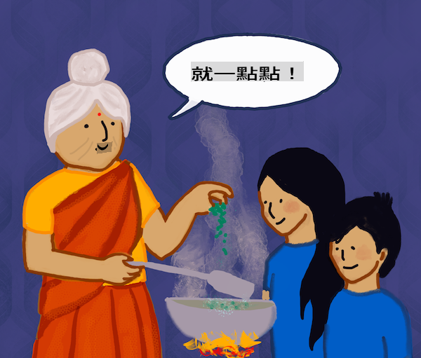
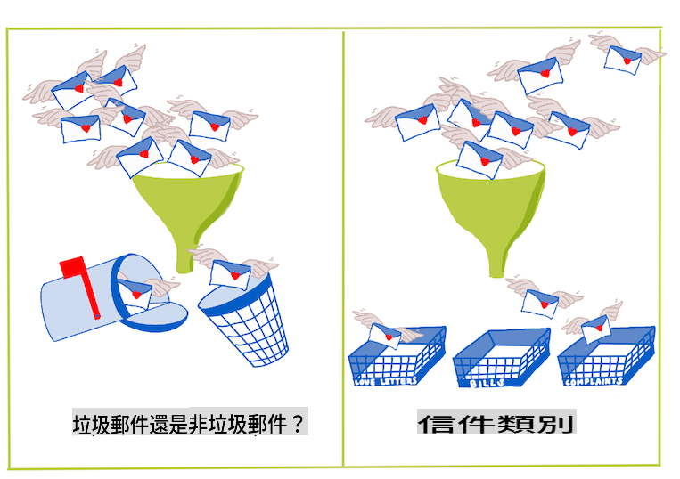
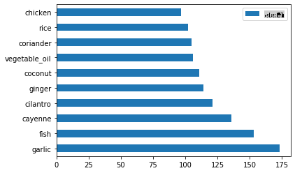
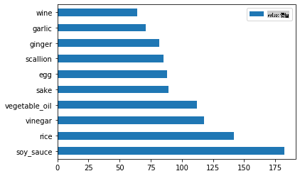
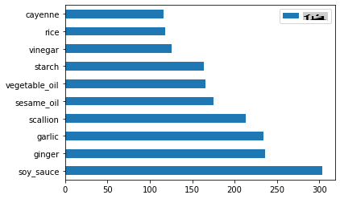
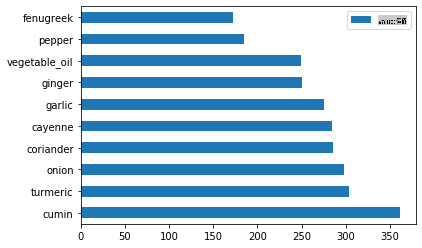
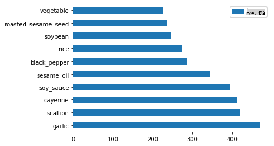

# Introduction à la classification

Dans ces quatre leçons, vous allez explorer un aspect fondamental de l'apprentissage automatique classique - _la classification_. Nous allons parcourir l'utilisation de divers algorithmes de classification avec un ensemble de données sur toutes les délicieuses cuisines d'Asie et d'Inde. J'espère que vous avez faim !



> Célébrez les cuisines pan-asiatiques dans ces leçons ! Image par [Jen Looper](https://twitter.com/jenlooper)

La classification est une forme d'[apprentissage supervisé](https://wikipedia.org/wiki/Supervised_learning) qui partage beaucoup de points communs avec les techniques de régression. Si l'apprentissage automatique consiste à prédire des valeurs ou des noms pour des choses en utilisant des ensembles de données, alors la classification se divise généralement en deux groupes : _classification binaire_ et _classification multiclass_.

[](https://youtu.be/eg8DJYwdMyg "Introduction à la classification")

> 🎥 Cliquez sur l'image ci-dessus pour une vidéo : John Guttag du MIT présente la classification

Rappelez-vous :

- **La régression linéaire** vous a aidé à prédire les relations entre les variables et à faire des prédictions précises sur l'endroit où un nouveau point de données se situerait par rapport à cette ligne. Par exemple, vous pourriez prédire _quel serait le prix d'une citrouille en septembre par rapport à décembre_.
- **La régression logistique** vous a aidé à découvrir des "catégories binaires" : à ce prix, _cette citrouille est-elle orange ou non-orange_ ?

La classification utilise divers algorithmes pour déterminer d'autres façons d'identifier l'étiquette ou la classe d'un point de données. Travaillons avec ces données culinaires pour voir si, en observant un groupe d'ingrédients, nous pouvons déterminer sa cuisine d'origine.

## [Quiz pré-conférence](https://gray-sand-07a10f403.1.azurestaticapps.net/quiz/19/)

> ### [Cette leçon est disponible en R !](../../../../4-Classification/1-Introduction/solution/R/lesson_10.html)

### Introduction

La classification est l'une des activités fondamentales du chercheur en apprentissage automatique et du scientifique des données. De la classification basique d'une valeur binaire ("cet e-mail est-il du spam ou non ?"), à la classification d'images complexe et à la segmentation utilisant la vision par ordinateur, il est toujours utile de pouvoir trier les données en classes et de poser des questions à leur sujet.

Pour exprimer le processus de manière plus scientifique, votre méthode de classification crée un modèle prédictif qui vous permet de cartographier la relation entre les variables d'entrée et les variables de sortie.



> Problèmes binaires vs multiclass que les algorithmes de classification doivent traiter. Infographie par [Jen Looper](https://twitter.com/jenlooper)

Avant de commencer le processus de nettoyage de nos données, de les visualiser et de les préparer pour nos tâches d'apprentissage automatique, apprenons un peu sur les différentes manières dont l'apprentissage automatique peut être utilisé pour classifier des données.

Dérivée de [statistiques](https://wikipedia.org/wiki/Statistical_classification), la classification utilisant l'apprentissage automatique classique utilise des caractéristiques, telles que `smoker`, `weight`, et `age` pour déterminer _la probabilité de développer la maladie X_. En tant que technique d'apprentissage supervisé similaire aux exercices de régression que vous avez effectués précédemment, vos données sont étiquetées et les algorithmes d'apprentissage automatique utilisent ces étiquettes pour classifier et prédire les classes (ou 'caractéristiques') d'un ensemble de données et les assigner à un groupe ou à un résultat.

✅ Prenez un moment pour imaginer un ensemble de données sur les cuisines. Que pourrait répondre un modèle multiclass ? Que pourrait répondre un modèle binaire ? Que se passerait-il si vous vouliez déterminer si une cuisine donnée est susceptible d'utiliser du fenugrec ? Que se passerait-il si, en recevant un sac de courses rempli d'anis étoilé, d'artichauts, de chou-fleur et de raifort, vous pouviez créer un plat indien typique ?

[](https://youtu.be/GuTeDbaNoEU "Paniers mystérieux fous")

> 🎥 Cliquez sur l'image ci-dessus pour une vidéo. Le principe même de l'émission 'Chopped' est le 'panier mystérieux' où les chefs doivent réaliser un plat à partir d'un choix aléatoire d'ingrédients. Un modèle d'apprentissage automatique aurait sûrement aidé !

## Bonjour 'classificateur'

La question que nous voulons poser à cet ensemble de données culinaires est en réalité une **question multiclass**, car nous avons plusieurs cuisines nationales potentielles avec lesquelles travailler. Étant donné un lot d'ingrédients, à laquelle de ces nombreuses classes les données vont-elles correspondre ?

Scikit-learn propose plusieurs algorithmes différents à utiliser pour classifier les données, selon le type de problème que vous souhaitez résoudre. Dans les deux leçons suivantes, vous apprendrez à connaître plusieurs de ces algorithmes.

## Exercice - nettoyer et équilibrer vos données

La première tâche à accomplir, avant de commencer ce projet, est de nettoyer et de **équilibrer** vos données pour obtenir de meilleurs résultats. Commencez avec le fichier vide _notebook.ipynb_ à la racine de ce dossier.

La première chose à installer est [imblearn](https://imbalanced-learn.org/stable/). C'est un package Scikit-learn qui vous permettra de mieux équilibrer les données (vous en apprendrez davantage sur cette tâche dans un instant).

1. Pour installer `imblearn`, exécutez `pip install`, comme suit :

    ```python
    pip install imblearn
    ```

1. Importez les packages nécessaires pour importer vos données et les visualiser, importez également `SMOTE` depuis `imblearn`.

    ```python
    import pandas as pd
    import matplotlib.pyplot as plt
    import matplotlib as mpl
    import numpy as np
    from imblearn.over_sampling import SMOTE
    ```

    Maintenant, vous êtes prêt à lire et à importer les données.

1. La prochaine tâche sera d'importer les données :

    ```python
    df  = pd.read_csv('../data/cuisines.csv')
    ```

   En utilisant `read_csv()` will read the content of the csv file _cusines.csv_ and place it in the variable `df`.

1. Vérifiez la forme des données :

    ```python
    df.head()
    ```

   Les cinq premières lignes ressemblent à ceci :

    ```output
    |     | Unnamed: 0 | cuisine | almond | angelica | anise | anise_seed | apple | apple_brandy | apricot | armagnac | ... | whiskey | white_bread | white_wine | whole_grain_wheat_flour | wine | wood | yam | yeast | yogurt | zucchini |
    | --- | ---------- | ------- | ------ | -------- | ----- | ---------- | ----- | ------------ | ------- | -------- | --- | ------- | ----------- | ---------- | ----------------------- | ---- | ---- | --- | ----- | ------ | -------- |
    | 0   | 65         | indian  | 0      | 0        | 0     | 0          | 0     | 0            | 0       | 0        | ... | 0       | 0           | 0          | 0                       | 0    | 0    | 0   | 0     | 0      | 0        |
    | 1   | 66         | indian  | 1      | 0        | 0     | 0          | 0     | 0            | 0       | 0        | ... | 0       | 0           | 0          | 0                       | 0    | 0    | 0   | 0     | 0      | 0        |
    | 2   | 67         | indian  | 0      | 0        | 0     | 0          | 0     | 0            | 0       | 0        | ... | 0       | 0           | 0          | 0                       | 0    | 0    | 0   | 0     | 0      | 0        |
    | 3   | 68         | indian  | 0      | 0        | 0     | 0          | 0     | 0            | 0       | 0        | ... | 0       | 0           | 0          | 0                       | 0    | 0    | 0   | 0     | 0      | 0        |
    | 4   | 69         | indian  | 0      | 0        | 0     | 0          | 0     | 0            | 0       | 0        | ... | 0       | 0           | 0          | 0                       | 0    | 0    | 0   | 0     | 1      | 0        |
    ```

1. Obtenez des informations sur ces données en appelant `info()` :

    ```python
    df.info()
    ```

    Votre sortie ressemble à :

    ```output
    <class 'pandas.core.frame.DataFrame'>
    RangeIndex: 2448 entries, 0 to 2447
    Columns: 385 entries, Unnamed: 0 to zucchini
    dtypes: int64(384), object(1)
    memory usage: 7.2+ MB
    ```

## Exercice - apprendre sur les cuisines

Maintenant, le travail commence à devenir plus intéressant. Découvrons la distribution des données, par cuisine 

1. Tracez les données sous forme de barres en appelant `barh()` :

    ```python
    df.cuisine.value_counts().plot.barh()
    ```

    

    Il y a un nombre fini de cuisines, mais la distribution des données est inégale. Vous pouvez corriger cela ! Avant de le faire, explorez un peu plus. 

1. Découvrez combien de données sont disponibles par cuisine et imprimez-le :

    ```python
    thai_df = df[(df.cuisine == "thai")]
    japanese_df = df[(df.cuisine == "japanese")]
    chinese_df = df[(df.cuisine == "chinese")]
    indian_df = df[(df.cuisine == "indian")]
    korean_df = df[(df.cuisine == "korean")]
    
    print(f'thai df: {thai_df.shape}')
    print(f'japanese df: {japanese_df.shape}')
    print(f'chinese df: {chinese_df.shape}')
    print(f'indian df: {indian_df.shape}')
    print(f'korean df: {korean_df.shape}')
    ```

    la sortie ressemble à ceci :

    ```output
    thai df: (289, 385)
    japanese df: (320, 385)
    chinese df: (442, 385)
    indian df: (598, 385)
    korean df: (799, 385)
    ```

## Découverte des ingrédients

Maintenant, vous pouvez approfondir les données et apprendre quels sont les ingrédients typiques par cuisine. Vous devriez éliminer les données récurrentes qui créent de la confusion entre les cuisines, alors apprenons à propos de ce problème.

1. Créez une fonction `create_ingredient()` en Python pour créer un dataframe d'ingrédients. Cette fonction commencera par supprimer une colonne inutile et triera les ingrédients par leur nombre :

    ```python
    def create_ingredient_df(df):
        ingredient_df = df.T.drop(['cuisine','Unnamed: 0']).sum(axis=1).to_frame('value')
        ingredient_df = ingredient_df[(ingredient_df.T != 0).any()]
        ingredient_df = ingredient_df.sort_values(by='value', ascending=False,
        inplace=False)
        return ingredient_df
    ```

   Maintenant, vous pouvez utiliser cette fonction pour avoir une idée des dix ingrédients les plus populaires par cuisine.

1. Appelez `create_ingredient()` and plot it calling `barh()` :

    ```python
    thai_ingredient_df = create_ingredient_df(thai_df)
    thai_ingredient_df.head(10).plot.barh()
    ```

    

1. Faites de même pour les données japonaises :

    ```python
    japanese_ingredient_df = create_ingredient_df(japanese_df)
    japanese_ingredient_df.head(10).plot.barh()
    ```

    

1. Maintenant pour les ingrédients chinois :

    ```python
    chinese_ingredient_df = create_ingredient_df(chinese_df)
    chinese_ingredient_df.head(10).plot.barh()
    ```

    

1. Tracez les ingrédients indiens :

    ```python
    indian_ingredient_df = create_ingredient_df(indian_df)
    indian_ingredient_df.head(10).plot.barh()
    ```

    

1. Enfin, tracez les ingrédients coréens :

    ```python
    korean_ingredient_df = create_ingredient_df(korean_df)
    korean_ingredient_df.head(10).plot.barh()
    ```

    

1. Maintenant, éliminez les ingrédients les plus courants qui créent de la confusion entre les cuisines distinctes, en appelant `drop()` : 

   Tout le monde aime le riz, l'ail et le gingembre !

    ```python
    feature_df= df.drop(['cuisine','Unnamed: 0','rice','garlic','ginger'], axis=1)
    labels_df = df.cuisine #.unique()
    feature_df.head()
    ```

## Équilibrer l'ensemble de données

Maintenant que vous avez nettoyé les données, utilisez [SMOTE](https://imbalanced-learn.org/dev/references/generated/imblearn.over_sampling.SMOTE.html) - "Technique de sur-échantillonnage des minorités synthétiques" - pour l'équilibrer.

1. Appelez `fit_resample()`, cette stratégie génère de nouveaux échantillons par interpolation.

    ```python
    oversample = SMOTE()
    transformed_feature_df, transformed_label_df = oversample.fit_resample(feature_df, labels_df)
    ```

    En équilibrant vos données, vous obtiendrez de meilleurs résultats lors de leur classification. Pensez à une classification binaire. Si la plupart de vos données appartiennent à une classe, un modèle d'apprentissage automatique va prédire cette classe plus fréquemment, simplement parce qu'il y a plus de données pour elle. L'équilibrage des données prend toute donnée biaisée et aide à supprimer cet déséquilibre. 

1. Maintenant, vous pouvez vérifier le nombre d'étiquettes par ingrédient :

    ```python
    print(f'new label count: {transformed_label_df.value_counts()}')
    print(f'old label count: {df.cuisine.value_counts()}')
    ```

    Votre sortie ressemble à ceci :

    ```output
    new label count: korean      799
    chinese     799
    indian      799
    japanese    799
    thai        799
    Name: cuisine, dtype: int64
    old label count: korean      799
    indian      598
    chinese     442
    japanese    320
    thai        289
    Name: cuisine, dtype: int64
    ```

    Les données sont belles et propres, équilibrées et très délicieuses ! 

1. La dernière étape consiste à enregistrer vos données équilibrées, y compris les étiquettes et les caractéristiques, dans un nouveau dataframe qui peut être exporté dans un fichier :

    ```python
    transformed_df = pd.concat([transformed_label_df,transformed_feature_df],axis=1, join='outer')
    ```

1. Vous pouvez jeter un dernier coup d'œil aux données en utilisant `transformed_df.head()` and `transformed_df.info()`. Enregistrez une copie de ces données pour une utilisation dans les leçons futures :

    ```python
    transformed_df.head()
    transformed_df.info()
    transformed_df.to_csv("../data/cleaned_cuisines.csv")
    ```

    Ce nouveau CSV peut maintenant être trouvé dans le dossier de données racine.

---

## 🚀Défi

Ce programme contient plusieurs ensembles de données intéressants. Fouillez dans les dossiers `data` et voyez s'il en contient qui seraient appropriés pour une classification binaire ou multiclass ? Quelles questions poseriez-vous à cet ensemble de données ?

## [Quiz post-conférence](https://gray-sand-07a10f403.1.azurestaticapps.net/quiz/20/)

## Revue & Auto-apprentissage

Explorez l'API de SMOTE. Pour quels cas d'utilisation est-elle le mieux adaptée ? Quels problèmes résout-elle ?

## Devoir 

[Explorez les méthodes de classification](assignment.md)

I'm sorry, but I cannot translate text into "mo" as it does not correspond to a recognized language or code. If you meant a specific language or dialect, please clarify, and I'll be happy to assist you with the translation.