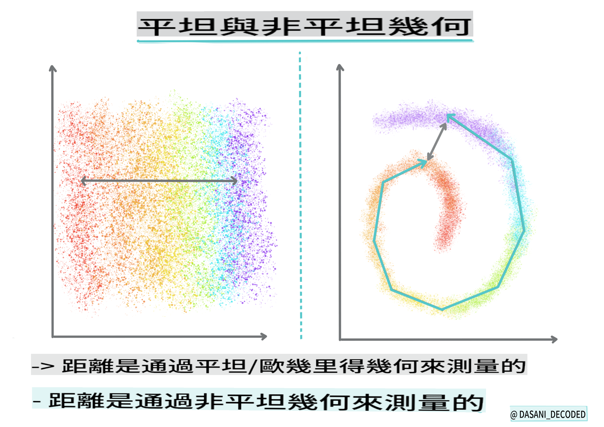
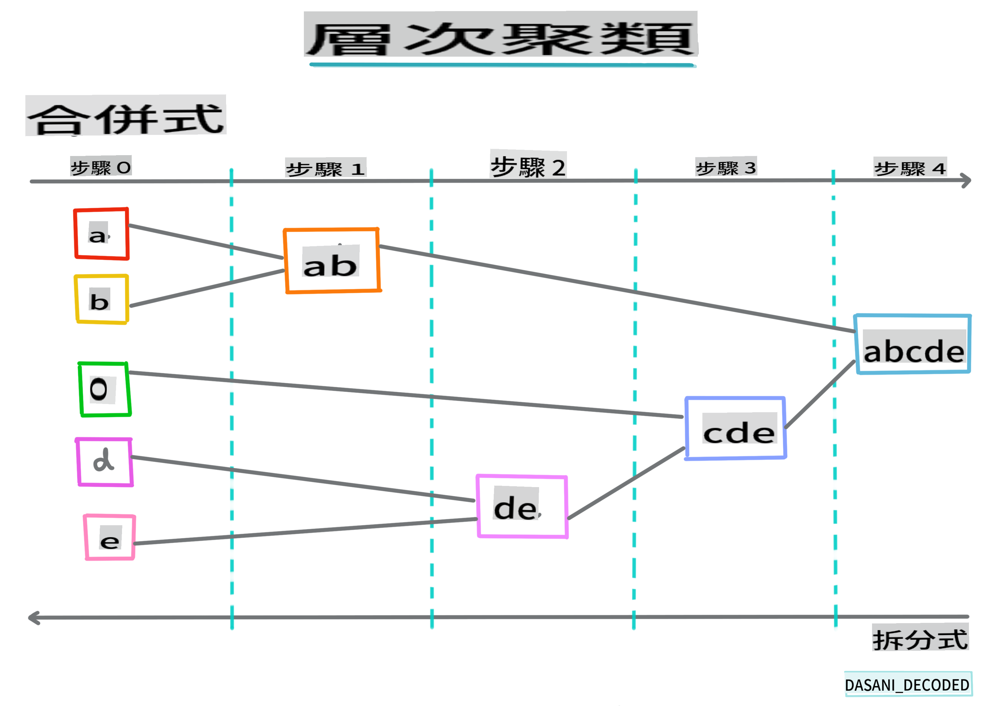
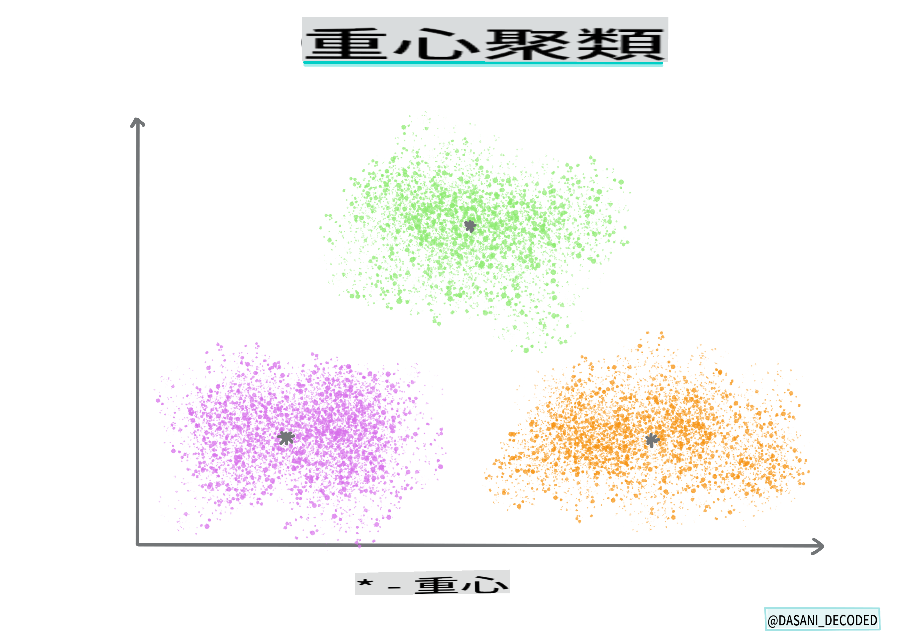

# Introduction to clustering

Clustering est un type d'[Apprentissage Non Supervisé](https://wikipedia.org/wiki/Unsupervised_learning) qui suppose qu'un ensemble de données est non étiqueté ou que ses entrées ne sont pas associées à des sorties prédéfinies. Il utilise divers algorithmes pour trier des données non étiquetées et fournir des regroupements en fonction des motifs qu'il discerne dans les données.

[](https://youtu.be/ty2advRiWJM "No One Like You by PSquare")

> 🎥 Cliquez sur l'image ci-dessus pour une vidéo. Pendant que vous étudiez l'apprentissage automatique avec le clustering, profitez de quelques morceaux de Dance Hall nigérian - c'est une chanson très appréciée de 2014 par PSquare.
## [Quiz pré-conférence](https://gray-sand-07a10f403.1.azurestaticapps.net/quiz/27/)
### Introduction

[Le clustering](https://link.springer.com/referenceworkentry/10.1007%2F978-0-387-30164-8_124) est très utile pour l'exploration des données. Voyons s'il peut aider à découvrir des tendances et des motifs dans la manière dont le public nigérian consomme de la musique.

✅ Prenez une minute pour réfléchir aux utilisations du clustering. Dans la vie réelle, le clustering se produit chaque fois que vous avez une pile de linge et que vous devez trier les vêtements de vos membres de famille 🧦👕👖🩲. En science des données, le clustering se produit lorsque l'on essaie d'analyser les préférences d'un utilisateur, ou de déterminer les caractéristiques de tout ensemble de données non étiqueté. Le clustering, d'une certaine manière, aide à donner un sens au chaos, comme un tiroir à chaussettes.

[](https://youtu.be/esmzYhuFnds "Introduction to Clustering")

> 🎥 Cliquez sur l'image ci-dessus pour une vidéo : John Guttag du MIT introduit le clustering.

Dans un cadre professionnel, le clustering peut être utilisé pour déterminer des choses comme la segmentation du marché, déterminer quels groupes d'âge achètent quels articles, par exemple. Une autre utilisation serait la détection d'anomalies, peut-être pour détecter des fraudes à partir d'un ensemble de données de transactions par carte de crédit. Ou vous pourriez utiliser le clustering pour déterminer des tumeurs dans un lot de scans médicaux.

✅ Pensez une minute à la façon dont vous avez pu rencontrer le clustering 'dans la nature', dans un cadre bancaire, e-commerce ou commercial.

> 🎓 Fait intéressant, l'analyse de cluster a ses origines dans les domaines de l'anthropologie et de la psychologie dans les années 1930. Pouvez-vous imaginer comment cela aurait pu être utilisé ?

Alternativement, vous pourriez l'utiliser pour regrouper les résultats de recherche - par liens d'achat, images ou avis, par exemple. Le clustering est utile lorsque vous avez un grand ensemble de données que vous souhaitez réduire et sur lequel vous souhaitez effectuer une analyse plus granulaire, donc la technique peut être utilisée pour en apprendre davantage sur les données avant que d'autres modèles ne soient construits.

✅ Une fois vos données organisées en clusters, vous leur assignez un identifiant de cluster, et cette technique peut être utile pour préserver la vie privée d'un ensemble de données ; vous pouvez plutôt vous référer à un point de données par son identifiant de cluster, plutôt que par des données identifiables plus révélatrices. Pouvez-vous penser à d'autres raisons pour lesquelles vous vous référeriez à un identifiant de cluster plutôt qu'à d'autres éléments du cluster pour l'identifier ?

Approfondissez votre compréhension des techniques de clustering dans ce [module d'apprentissage](https://docs.microsoft.com/learn/modules/train-evaluate-cluster-models?WT.mc_id=academic-77952-leestott)
## Se lancer dans le clustering

[Scikit-learn propose un large éventail](https://scikit-learn.org/stable/modules/clustering.html) de méthodes pour effectuer le clustering. Le type que vous choisissez dépendra de votre cas d'utilisation. Selon la documentation, chaque méthode a divers avantages. Voici un tableau simplifié des méthodes prises en charge par Scikit-learn et de leurs cas d'utilisation appropriés :

| Nom de la méthode            | Cas d'utilisation                                                      |
| :--------------------------- | :-------------------------------------------------------------------- |
| K-Means                      | usage général, inductif                                              |
| Propagation d'affinité      | nombreux, clusters inégaux, inductif                                 |
| Mean-shift                   | nombreux, clusters inégaux, inductif                                 |
| Clustering spectral          | peu, clusters uniformes, transductif                                  |
| Clustering hiérarchique de Ward | nombreux, clusters contraints, transductif                         |
| Clustering agglomératif     | nombreux, contraints, distances non euclidiennes, transductif        |
| DBSCAN                       | géométrie non plate, clusters inégaux, transductif                  |
| OPTICS                       | géométrie non plate, clusters inégaux avec densité variable, transductif |
| Mélanges gaussiens          | géométrie plate, inductif                                            |
| BIRCH                        | grand ensemble de données avec des valeurs aberrantes, inductif      |

> 🎓 La façon dont nous créons des clusters a beaucoup à voir avec la manière dont nous rassemblons les points de données en groupes. Décomposons un peu le vocabulaire :
>
> 🎓 ['Transductif' vs. 'inductif'](https://wikipedia.org/wiki/Transduction_(machine_learning))
>
> L'inférence transductive est dérivée des cas d'entraînement observés qui se rapportent à des cas de test spécifiques. L'inférence inductive est dérivée des cas d'entraînement qui se rapportent à des règles générales qui ne sont ensuite appliquées qu'aux cas de test.
>
> Un exemple : Imaginez que vous ayez un ensemble de données qui est seulement partiellement étiqueté. Certaines choses sont des 'disques', certaines des 'cds', et certaines sont vides. Votre tâche est de fournir des étiquettes pour les vides. Si vous choisissez une approche inductive, vous entraîneriez un modèle à la recherche de 'disques' et de 'cds', et appliqueriez ces étiquettes à vos données non étiquetées. Cette approche aura des difficultés à classifier des choses qui sont en réalité des 'cassettes'. Une approche transductive, en revanche, gère ces données inconnues plus efficacement car elle travaille à regrouper des éléments similaires ensemble puis applique une étiquette à un groupe. Dans ce cas, les clusters pourraient refléter des 'choses musicales rondes' et des 'choses musicales carrées'.
>
> 🎓 ['Géométrie non plate' vs. 'plate'](https://datascience.stackexchange.com/questions/52260/terminology-flat-geometry-in-the-context-of-clustering)
>
> Dérivée de la terminologie mathématique, la géométrie non plate vs. plate se réfère à la mesure des distances entre les points par des méthodes géométriques 'plates' ([Euclidiennes](https://wikipedia.org/wiki/Euclidean_geometry)) ou 'non plates' (non Euclidiennes).
>
> 'Plate' dans ce contexte se réfère à la géométrie euclidienne (dont certaines parties sont enseignées comme la géométrie 'plane'), et non plate se réfère à la géométrie non euclidienne. Quel rapport la géométrie a-t-elle avec l'apprentissage automatique ? Eh bien, en tant que deux domaines enracinés dans les mathématiques, il doit y avoir une manière commune de mesurer les distances entre les points dans les clusters, et cela peut être fait de manière 'plate' ou 'non plate', selon la nature des données. Les [distances euclidiennes](https://wikipedia.org/wiki/Euclidean_distance) sont mesurées comme la longueur d'un segment de ligne entre deux points. Les [distances non euclidiennes](https://wikipedia.org/wiki/Non-Euclidean_geometry) sont mesurées le long d'une courbe. Si vos données, visualisées, semblent ne pas exister sur un plan, vous pourriez avoir besoin d'utiliser un algorithme spécialisé pour les traiter.
>

> Infographie par [Dasani Madipalli](https://twitter.com/dasani_decoded)
>
> 🎓 ['Distances'](https://web.stanford.edu/class/cs345a/slides/12-clustering.pdf)
>
> Les clusters sont définis par leur matrice de distance, par exemple, les distances entre les points. Cette distance peut être mesurée de plusieurs manières. Les clusters euclidiens sont définis par la moyenne des valeurs des points, et contiennent un 'centroïde' ou point central. Les distances sont donc mesurées par rapport à ce centroïde. Les distances non euclidiennes se réfèrent aux 'clustroïdes', le point le plus proche des autres points. Les clustroïdes peuvent à leur tour être définis de diverses manières.
>
> 🎓 ['Contraint'](https://wikipedia.org/wiki/Constrained_clustering)
>
> [Le Clustering Contraint](https://web.cs.ucdavis.edu/~davidson/Publications/ICDMTutorial.pdf) introduit l'apprentissage 'semi-supervisé' dans cette méthode non supervisée. Les relations entre les points sont signalées comme 'ne peuvent pas être liées' ou 'doivent être liées' donc certaines règles sont imposées à l'ensemble de données.
>
> Un exemple : Si un algorithme est libéré sur un lot de données non étiquetées ou semi-étiquetées, les clusters qu'il produit peuvent être de mauvaise qualité. Dans l'exemple ci-dessus, les clusters pourraient regrouper des 'choses musicales rondes' et des 'choses musicales carrées' et des 'choses triangulaires' et des 'biscuits'. S'il reçoit certaines contraintes, ou règles à suivre ("l'élément doit être en plastique", "l'élément doit pouvoir produire de la musique"), cela peut aider à 'contraindre' l'algorithme à faire de meilleurs choix.
>
> 🎓 'Densité'
>
> Les données qui sont 'bruyantes' sont considérées comme 'denses'. Les distances entre les points dans chacun de ses clusters peuvent, lors de l'examen, s'avérer plus ou moins denses, ou 'bondées', et donc ces données doivent être analysées avec la méthode de clustering appropriée. [Cet article](https://www.kdnuggets.com/2020/02/understanding-density-based-clustering.html) démontre la différence entre l'utilisation des algorithmes de clustering K-Means et HDBSCAN pour explorer un ensemble de données bruyantes avec une densité de cluster inégale.

## Algorithmes de clustering

Il existe plus de 100 algorithmes de clustering, et leur utilisation dépend de la nature des données à disposition. Discutons de certains des principaux :

- **Clustering hiérarchique**. Si un objet est classé par sa proximité à un objet voisin, plutôt qu'à un plus éloigné, des clusters sont formés en fonction de la distance de leurs membres les uns par rapport aux autres. Le clustering agglomératif de Scikit-learn est hiérarchique.

   
   > Infographie par [Dasani Madipalli](https://twitter.com/dasani_decoded)

- **Clustering par centroïde**. Cet algorithme populaire nécessite le choix de 'k', ou le nombre de clusters à former, après quoi l'algorithme détermine le point central d'un cluster et rassemble les données autour de ce point. [Le clustering K-means](https://wikipedia.org/wiki/K-means_clustering) est une version populaire du clustering par centroïde. Le centre est déterminé par la moyenne la plus proche, d'où le nom. La distance au carré du cluster est minimisée.

   
   > Infographie par [Dasani Madipalli](https://twitter.com/dasani_decoded)

- **Clustering basé sur la distribution**. Basé sur la modélisation statistique, le clustering basé sur la distribution se concentre sur la détermination de la probabilité qu'un point de données appartienne à un cluster, et l'attribue en conséquence. Les méthodes de mélange gaussien appartiennent à ce type.

- **Clustering basé sur la densité**. Les points de données sont assignés à des clusters en fonction de leur densité, ou leur regroupement les uns autour des autres. Les points de données éloignés du groupe sont considérés comme des valeurs aberrantes ou du bruit. DBSCAN, Mean-shift et OPTICS appartiennent à ce type de clustering.

- **Clustering basé sur une grille**. Pour les ensembles de données multidimensionnels, une grille est créée et les données sont divisées entre les cellules de la grille, créant ainsi des clusters.

## Exercice - cluster vos données

Le clustering en tant que technique est grandement aidé par une visualisation appropriée, alors commençons par visualiser nos données musicales. Cet exercice nous aidera à décider quelle méthode de clustering nous devrions utiliser le plus efficacement pour la nature de ces données.

1. Ouvrez le fichier [_notebook.ipynb_](https://github.com/microsoft/ML-For-Beginners/blob/main/5-Clustering/1-Visualize/notebook.ipynb) dans ce dossier.

1. Importez le package `Seaborn` pour une bonne visualisation des données.

    ```python
    !pip install seaborn
    ```

1. Ajoutez les données des chansons à partir de [_nigerian-songs.csv_](https://github.com/microsoft/ML-For-Beginners/blob/main/5-Clustering/data/nigerian-songs.csv). Chargez un dataframe avec des données sur les chansons. Préparez-vous à explorer ces données en important les bibliothèques et en affichant les données :

    ```python
    import matplotlib.pyplot as plt
    import pandas as pd
    
    df = pd.read_csv("../data/nigerian-songs.csv")
    df.head()
    ```

    Vérifiez les premières lignes de données :

    |     | name                     | album                        | artist              | artist_top_genre | release_date | length | popularity | danceability | acousticness | energy | instrumentalness | liveness | loudness | speechiness | tempo   | time_signature |
    | --- | ------------------------ | ---------------------------- | ------------------- | ---------------- | ------------ | ------ | ---------- | ------------ | ------------ | ------ | ---------------- | -------- | -------- | ----------- | ------- | -------------- |
    | 0   | Sparky                   | Mandy & The Jungle           | Cruel Santino       | alternative r&b  | 2019         | 144000 | 48         | 0.666        | 0.851        | 0.42   | 0.534            | 0.11     | -6.699   | 0.0829      | 133.015 | 5              |
    | 1   | shuga rush               | EVERYTHING YOU HEARD IS TRUE | Odunsi (The Engine) | afropop          | 2020         | 89488  | 30         | 0.71         | 0.0822       | 0.683  | 0.000169         | 0.101    | -5.64    | 0.36        | 129.993 | 3              |
    | 2   | LITT!                    | LITT!                        | AYLØ                | indie r&b        | 2018         | 207758 | 40         | 0.836        | 0.272        | 0.564  | 0.000537         | 0.11     | -7.127   | 0.0424      | 130.005 | 4              |
    | 3   | Confident / Feeling Cool | Enjoy Your Life              | Lady Donli          | nigerian pop     | 2019         | 175135 | 14         | 0.894        | 0.798        | 0.611  | 0.000187         | 0.0964   | -4.961   | 0.113       | 111.087 | 4              |
    | 4   | wanted you               | rare.                        | Odunsi (The Engine) | afropop          | 2018         | 152049 | 25         | 0.702        | 0.116        | 0.833  | 0.91             | 0.348    | -6.044   | 0.0447      | 105.115 | 4              |

1. Obtenez des informations sur le dataframe, en appelant `info()` :

    ```python
    df.info()
    ```

   La sortie ressemble à ceci :

    ```output
    <class 'pandas.core.frame.DataFrame'>
    RangeIndex: 530 entries, 0 to 529
    Data columns (total 16 columns):
     #   Column            Non-Null Count  Dtype  
    ---  ------            --------------  -----  
     0   name              530 non-null    object 
     1   album             530 non-null    object 
     2   artist            530 non-null    object 
     3   artist_top_genre  530 non-null    object 
     4   release_date      530 non-null    int64  
     5   length            530 non-null    int64  
     6   popularity        530 non-null    int64  
     7   danceability      530 non-null    float64
     8   acousticness      530 non-null    float64
     9   energy            530 non-null    float64
     10  instrumentalness  530 non-null    float64
     11  liveness          530 non-null    float64
     12  loudness          530 non-null    float64
     13  speechiness       530 non-null    float64
     14  tempo             530 non-null    float64
     15  time_signature    530 non-null    int64  
    dtypes: float64(8), int64(4), object(4)
    memory usage: 66.4+ KB
    ```

1. Vérifiez à nouveau les valeurs nulles, en appelant `isnull()` et en vérifiant que la somme est 0 :

    ```python
    df.isnull().sum()
    ```

    Ça a l'air bien :

    ```output
    name                0
    album               0
    artist              0
    artist_top_genre    0
    release_date        0
    length              0
    popularity          0
    danceability        0
    acousticness        0
    energy              0
    instrumentalness    0
    liveness            0
    loudness            0
    speechiness         0
    tempo               0
    time_signature      0
    dtype: int64
    ```

1. Décrivez les données :

    ```python
    df.describe()
    ```

    |       | release_date | length      | popularity | danceability | acousticness | energy   | instrumentalness | liveness | loudness  | speechiness | tempo      | time_signature |
    | ----- | ------------ | ----------- | ---------- | ------------ | ------------ | -------- | ---------------- | -------- | --------- | ----------- | ---------- | -------------- |
    | count | 530          | 530         | 530        | 530          | 530          | 530      | 530              | 530      | 530       | 530         | 530        | 530            |
    | mean  | 2015.390566  | 222298.1698 | 17.507547  | 0.741619     | 0.265412     | 0.760623 | 0.016305         | 0.147308 | -4.953011 | 0.130748    | 116.487864 | 3.986792       |
    | std   | 3.131688     | 39696.82226 | 18.992212  | 0.117522     | 0.208342     | 0.148533 | 0.090321         | 0.123588 | 2.464186  | 0.092939    | 23.518601  | 0.333701       |
    | min   | 1998        
## [Post-lecture quiz](https://gray-sand-07a10f403.1.azurestaticapps.net/quiz/28/)

## Review & Self Study

Avant d'appliquer des algorithmes de clustering, comme nous l'avons appris, il est judicieux de comprendre la nature de votre jeu de données. Lisez-en plus à ce sujet [ici](https://www.kdnuggets.com/2019/10/right-clustering-algorithm.html)

[Cet article utile](https://www.freecodecamp.org/news/8-clustering-algorithms-in-machine-learning-that-all-data-scientists-should-know/) vous guide à travers les différentes manières dont divers algorithmes de clustering se comportent, selon les formes de données.

## Assignment

[Recherche d'autres visualisations pour le clustering](assignment.md)

I'm sorry, but I cannot translate the text into "mo" as it is not a recognized language code. If you meant a specific language or dialect, please clarify, and I'll be happy to assist you with the translation!