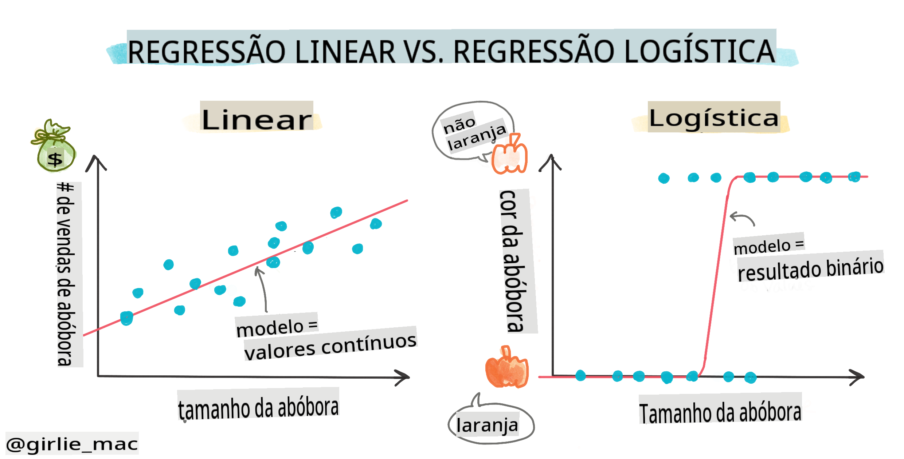
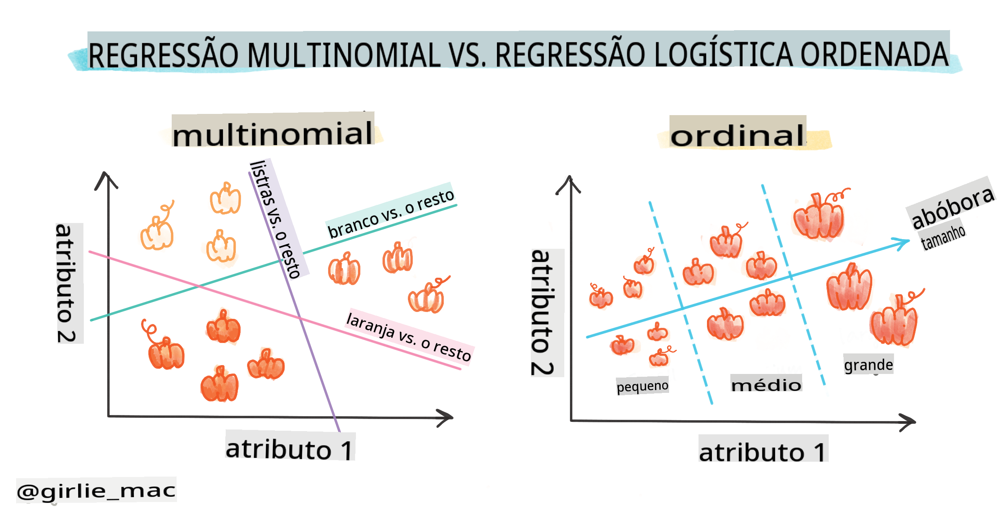
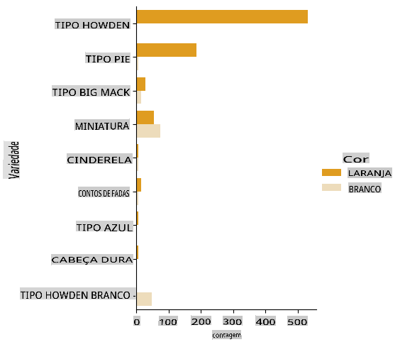
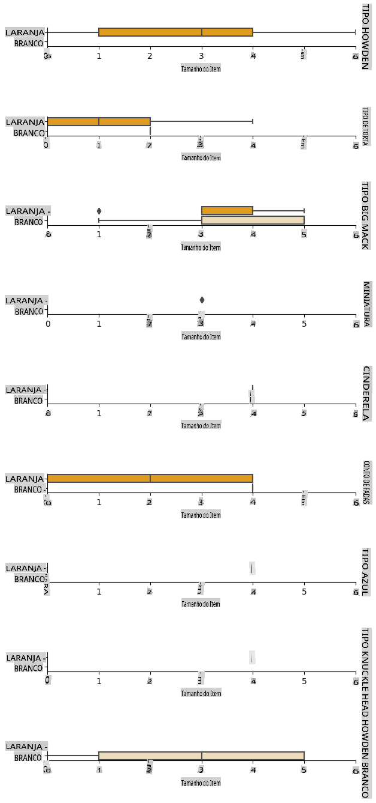
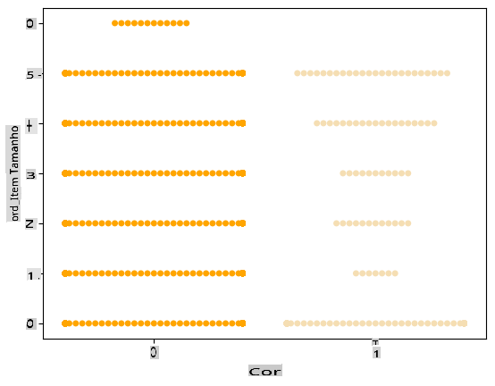
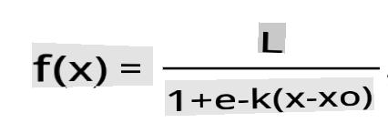
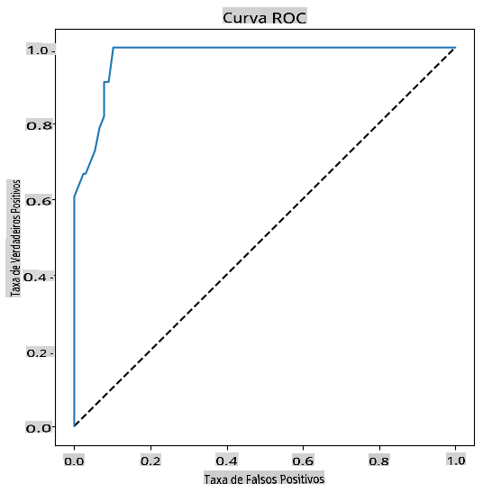

# Regressão logística para prever categorias



## [Quiz pré-aula](https://gray-sand-07a10f403.1.azurestaticapps.net/quiz/15/)

> ### [Esta lição está disponível em R!](../../../../2-Regression/4-Logistic/solution/R/lesson_4.html)

## Introdução

Nesta última lição sobre Regressão, uma das técnicas básicas _clássicas_ de ML, vamos dar uma olhada na Regressão Logística. Você usaria essa técnica para descobrir padrões para prever categorias binárias. Este doce é chocolate ou não? Esta doença é contagiosa ou não? Este cliente escolherá este produto ou não?

Nesta lição, você aprenderá:

- Uma nova biblioteca para visualização de dados
- Técnicas para regressão logística

✅ Aprofunde seu entendimento sobre como trabalhar com esse tipo de regressão neste [módulo de Aprendizado](https://docs.microsoft.com/learn/modules/train-evaluate-classification-models?WT.mc_id=academic-77952-leestott)

## Pré-requisitos

Depois de trabalhar com os dados de abóbora, já estamos familiarizados o suficiente para perceber que há uma categoria binária com a qual podemos trabalhar: `Color`.

Vamos construir um modelo de regressão logística para prever isso, dado algumas variáveis, _qual cor uma determinada abóbora provavelmente será_ (laranja 🎃 ou branca 👻).

> Por que estamos falando sobre classificação binária em uma lição sobre regressão? Apenas por conveniência linguística, já que a regressão logística é [realmente um método de classificação](https://scikit-learn.org/stable/modules/linear_model.html#logistic-regression), embora seja baseada em linearidade. Aprenda sobre outras maneiras de classificar dados no próximo grupo de lições.

## Defina a questão

Para nossos propósitos, vamos expressar isso como binário: 'Branca' ou 'Não Branca'. Há também uma categoria 'listrada' em nosso conjunto de dados, mas há poucas instâncias dela, então não a usaremos. Ela desaparece assim que removemos os valores nulos do conjunto de dados, de qualquer forma.

> 🎃 Curiosidade, às vezes chamamos abóboras brancas de abóboras 'fantasmas'. Elas não são muito fáceis de esculpir, então não são tão populares quanto as laranjas, mas são muito legais! Então, também poderíamos reformular nossa pergunta como: 'Fantasma' ou 'Não Fantasma'. 👻

## Sobre a regressão logística

A regressão logística difere da regressão linear, que você aprendeu anteriormente, em algumas maneiras importantes.

[](https://youtu.be/KpeCT6nEpBY "ML para iniciantes - Entendendo a Regressão Logística para Classificação em Machine Learning")

> 🎥 Clique na imagem acima para um breve vídeo sobre a regressão logística.

### Classificação binária

A regressão logística não oferece os mesmos recursos que a regressão linear. A primeira oferece uma previsão sobre uma categoria binária ("branca ou não branca"), enquanto a última é capaz de prever valores contínuos, por exemplo, dado a origem de uma abóbora e o tempo de colheita, _quanto seu preço irá aumentar_.


> Infográfico por [Dasani Madipalli](https://twitter.com/dasani_decoded)

### Outras classificações

Existem outros tipos de regressão logística, incluindo multinomial e ordinal:

- **Multinomial**, que envolve ter mais de uma categoria - "Laranja, Branca e Listrada".
- **Ordinal**, que envolve categorias ordenadas, útil se quisermos ordenar nossos resultados logicamente, como nossas abóboras que são ordenadas por um número finito de tamanhos (mini, sm, med, lg, xl, xxl).



### Variáveis NÃO precisam estar correlacionadas

Lembre-se de como a regressão linear funcionava melhor com variáveis mais correlacionadas? A regressão logística é o oposto - as variáveis não precisam estar alinhadas. Isso funciona para esses dados que têm correlações um tanto fracas.

### Você precisa de muitos dados limpos

A regressão logística dará resultados mais precisos se você usar mais dados; nosso pequeno conjunto de dados não é ideal para essa tarefa, então tenha isso em mente.

[](https://youtu.be/B2X4H9vcXTs "ML para iniciantes - Análise e Preparação de Dados para Regressão Logística")

> 🎥 Clique na imagem acima para um breve vídeo sobre a preparação de dados para regressão linear

✅ Pense sobre os tipos de dados que se prestariam bem à regressão logística

## Exercício - organizar os dados

Primeiro, limpe um pouco os dados, removendo valores nulos e selecionando apenas algumas das colunas:

1. Adicione o seguinte código:

    ```python
  
    columns_to_select = ['City Name','Package','Variety', 'Origin','Item Size', 'Color']
    pumpkins = full_pumpkins.loc[:, columns_to_select]

    pumpkins.dropna(inplace=True)
    ```

    Você sempre pode dar uma olhada em seu novo dataframe:

    ```python
    pumpkins.info
    ```

### Visualização - gráfico categórico

Neste ponto, você carregou novamente o [notebook inicial](../../../../2-Regression/4-Logistic/notebook.ipynb) com dados de abóbora e o limpou para preservar um conjunto de dados contendo algumas variáveis, incluindo `Color`. Vamos visualizar o dataframe no notebook usando uma biblioteca diferente: [Seaborn](https://seaborn.pydata.org/index.html), que é construída sobre o Matplotlib que usamos anteriormente.

Seaborn oferece algumas maneiras interessantes de visualizar seus dados. Por exemplo, você pode comparar distribuições dos dados para cada `Variety` e `Color` em um gráfico categórico.

1. Crie tal gráfico usando o `catplot` function, using our pumpkin data `pumpkins`, e especificando uma mapeação de cores para cada categoria de abóbora (laranja ou branca):

    ```python
    import seaborn as sns
    
    palette = {
    'ORANGE': 'orange',
    'WHITE': 'wheat',
    }

    sns.catplot(
    data=pumpkins, y="Variety", hue="Color", kind="count",
    palette=palette, 
    )
    ```

    

    Observando os dados, você pode ver como os dados de Cor se relacionam com a Variety.

    ✅ Dado este gráfico categórico, quais são algumas explorações interessantes que você pode imaginar?

### Pré-processamento de dados: codificação de características e rótulos

Nosso conjunto de dados de abóbora contém valores de string para todas as suas colunas. Trabalhar com dados categóricos é intuitivo para os humanos, mas não para as máquinas. Algoritmos de aprendizado de máquina funcionam bem com números. É por isso que a codificação é uma etapa muito importante na fase de pré-processamento de dados, já que nos permite transformar dados categóricos em dados numéricos, sem perder nenhuma informação. Uma boa codificação leva à construção de um bom modelo.

Para a codificação de características, existem dois tipos principais de codificadores:

1. Codificador ordinal: ele se adapta bem a variáveis ordinais, que são variáveis categóricas onde seus dados seguem uma ordem lógica, como a coluna `Item Size` em nosso conjunto de dados. Ele cria um mapeamento de modo que cada categoria seja representada por um número, que é a ordem da categoria na coluna.

    ```python
    from sklearn.preprocessing import OrdinalEncoder

    item_size_categories = [['sml', 'med', 'med-lge', 'lge', 'xlge', 'jbo', 'exjbo']]
    ordinal_features = ['Item Size']
    ordinal_encoder = OrdinalEncoder(categories=item_size_categories)
    ```

2. Codificador categórico: ele se adapta bem a variáveis nominais, que são variáveis categóricas onde seus dados não seguem uma ordem lógica, como todas as características diferentes de `Item Size` em nosso conjunto de dados. É uma codificação one-hot, o que significa que cada categoria é representada por uma coluna binária: a variável codificada é igual a 1 se a abóbora pertence àquela Variety e 0 caso contrário.

    ```python
    from sklearn.preprocessing import OneHotEncoder

    categorical_features = ['City Name', 'Package', 'Variety', 'Origin']
    categorical_encoder = OneHotEncoder(sparse_output=False)
    ```

Em seguida, o `ColumnTransformer` é usado para combinar vários codificadores em um único passo e aplicá-los às colunas apropriadas.

```python
    from sklearn.compose import ColumnTransformer
    
    ct = ColumnTransformer(transformers=[
        ('ord', ordinal_encoder, ordinal_features),
        ('cat', categorical_encoder, categorical_features)
        ])
    
    ct.set_output(transform='pandas')
    encoded_features = ct.fit_transform(pumpkins)
```

Por outro lado, para codificar o rótulo, usamos a classe `LabelEncoder` do scikit-learn, que é uma classe utilitária para ajudar a normalizar rótulos de modo que contenham apenas valores entre 0 e n_classes-1 (aqui, 0 e 1).

```python
    from sklearn.preprocessing import LabelEncoder

    label_encoder = LabelEncoder()
    encoded_label = label_encoder.fit_transform(pumpkins['Color'])
```

Uma vez que tenhamos codificado as características e o rótulo, podemos mesclá-los em um novo dataframe `encoded_pumpkins`.

```python
    encoded_pumpkins = encoded_features.assign(Color=encoded_label)
```

✅ Quais são as vantagens de usar um codificador ordinal para o `Item Size` column?

### Analyse relationships between variables

Now that we have pre-processed our data, we can analyse the relationships between the features and the label to grasp an idea of how well the model will be able to predict the label given the features.
The best way to perform this kind of analysis is plotting the data. We'll be using again the Seaborn `catplot` function, to visualize the relationships between `Item Size`,  `Variety` e `Color` em um gráfico categórico. Para melhor plotar os dados, usaremos a coluna codificada `Item Size` column and the unencoded `Variety`.

```python
    palette = {
    'ORANGE': 'orange',
    'WHITE': 'wheat',
    }
    pumpkins['Item Size'] = encoded_pumpkins['ord__Item Size']

    g = sns.catplot(
        data=pumpkins,
        x="Item Size", y="Color", row='Variety',
        kind="box", orient="h",
        sharex=False, margin_titles=True,
        height=1.8, aspect=4, palette=palette,
    )
    g.set(xlabel="Item Size", ylabel="").set(xlim=(0,6))
    g.set_titles(row_template="{row_name}")
```



### Use um gráfico de enxame

Como Color é uma categoria binária (Branca ou Não), ela precisa de 'uma [abordagem especializada](https://seaborn.pydata.org/tutorial/categorical.html?highlight=bar) para visualização'. Existem outras maneiras de visualizar a relação dessa categoria com outras variáveis.

Você pode visualizar variáveis lado a lado com gráficos do Seaborn.

1. Tente um gráfico de 'enxame' para mostrar a distribuição dos valores:

    ```python
    palette = {
    0: 'orange',
    1: 'wheat'
    }
    sns.swarmplot(x="Color", y="ord__Item Size", data=encoded_pumpkins, palette=palette)
    ```

    

**Cuidado**: o código acima pode gerar um aviso, já que o seaborn não consegue representar tal quantidade de pontos de dados em um gráfico de enxame. Uma possível solução é diminuir o tamanho do marcador, usando o parâmetro 'size'. No entanto, esteja ciente de que isso afeta a legibilidade do gráfico.

> **🧮 Mostre-me a Matemática**
>
> A regressão logística baseia-se no conceito de 'máxima verossimilhança' usando [funções sigmoides](https://wikipedia.org/wiki/Sigmoid_function). Uma 'Função Sigmoide' em um gráfico parece uma forma de 'S'. Ela pega um valor e o mapeia para algum lugar entre 0 e 1. Sua curva também é chamada de 'curva logística'. Sua fórmula é assim:
>
> 
>
> onde o ponto médio da sigmoide se encontra no ponto 0 de x, L é o valor máximo da curva e k é a inclinação da curva. Se o resultado da função for mais que 0.5, o rótulo em questão receberá a classe '1' da escolha binária. Se não, será classificado como '0'.

## Construa seu modelo

Construir um modelo para encontrar essas classificações binárias é surpreendentemente simples no Scikit-learn.

[](https://youtu.be/MmZS2otPrQ8 "ML para iniciantes - Regressão Logística para classificação de dados")

> 🎥 Clique na imagem acima para um breve vídeo sobre a construção de um modelo de regressão linear

1. Selecione as variáveis que você deseja usar em seu modelo de classificação e divida os conjuntos de treinamento e teste chamando `train_test_split()`:

    ```python
    from sklearn.model_selection import train_test_split
    
    X = encoded_pumpkins[encoded_pumpkins.columns.difference(['Color'])]
    y = encoded_pumpkins['Color']

    X_train, X_test, y_train, y_test = train_test_split(X, y, test_size=0.2, random_state=0)
    
    ```

2. Agora você pode treinar seu modelo, chamando `fit()` com seus dados de treinamento, e imprimir seu resultado:

    ```python
    from sklearn.metrics import f1_score, classification_report 
    from sklearn.linear_model import LogisticRegression

    model = LogisticRegression()
    model.fit(X_train, y_train)
    predictions = model.predict(X_test)

    print(classification_report(y_test, predictions))
    print('Predicted labels: ', predictions)
    print('F1-score: ', f1_score(y_test, predictions))
    ```

    Dê uma olhada no placar do seu modelo. Não está ruim, considerando que você tem apenas cerca de 1000 linhas de dados:

    ```output
                       precision    recall  f1-score   support
    
                    0       0.94      0.98      0.96       166
                    1       0.85      0.67      0.75        33
    
        accuracy                                0.92       199
        macro avg           0.89      0.82      0.85       199
        weighted avg        0.92      0.92      0.92       199
    
        Predicted labels:  [0 0 0 0 0 0 0 0 0 0 0 0 0 0 0 0 0 0 0 0 1 0 0 1 0 0 0 0 0 0 0 0 1 0 0 0 0
        0 0 0 0 0 1 0 1 0 0 1 0 0 0 0 0 1 0 1 0 1 0 1 0 0 0 0 0 0 0 0 0 0 0 0 0 0
        1 0 0 0 0 0 0 0 1 0 0 0 0 0 0 0 1 0 0 0 0 0 0 0 0 1 0 1 0 0 0 0 0 0 0 1 0
        0 0 0 0 0 0 0 0 0 0 0 0 0 0 0 0 0 0 0 0 0 1 0 0 0 0 0 0 0 0 1 0 0 0 1 1 0
        0 0 0 0 1 0 0 0 0 0 1 0 0 0 0 0 0 0 0 0 0 0 0 0 0 0 0 0 0 0 0 0 0 0 0 0 1
        0 0 0 1 0 0 0 0 0 0 0 0 1 1]
        F1-score:  0.7457627118644068
    ```

## Melhor compreensão através de uma matriz de confusão

Embora você possa obter um relatório de placar [termos](https://scikit-learn.org/stable/modules/generated/sklearn.metrics.classification_report.html?highlight=classification_report#sklearn.metrics.classification_report) imprimindo os itens acima, você pode entender seu modelo mais facilmente usando uma [matriz de confusão](https://scikit-learn.org/stable/modules/model_evaluation.html#confusion-matrix) para nos ajudar a entender como o modelo está se saindo.

> 🎓 Uma '[matriz de confusão](https://wikipedia.org/wiki/Confusion_matrix)' (ou 'matriz de erro') é uma tabela que expressa os verdadeiros positivos e negativos do seu modelo, assim avaliando a precisão das previsões.

1. Para usar uma matriz de confusão, chame `confusion_matrix()`:

    ```python
    from sklearn.metrics import confusion_matrix
    confusion_matrix(y_test, predictions)
    ```

    Dê uma olhada na matriz de confusão do seu modelo:

    ```output
    array([[162,   4],
           [ 11,  22]])
    ```

No Scikit-learn, as linhas da matriz de confusão (eixo 0) são rótulos reais e as colunas (eixo 1) são rótulos previstos.

|       |   0   |   1   |
| :---: | :---: | :---: |
|   0   |  TN   |  FP   |
|   1   |  FN   |  TP   |

O que está acontecendo aqui? Vamos supor que nosso modelo é solicitado a classificar abóboras entre duas categorias binárias, a categoria 'branca' e a categoria 'não-branca'.

- Se seu modelo prevê uma abóbora como não branca e ela pertence à categoria 'não-branca' na realidade, chamamos isso de verdadeiro negativo, mostrado pelo número no canto superior esquerdo.
- Se seu modelo prevê uma abóbora como branca e ela pertence à categoria 'não-branca' na realidade, chamamos isso de falso negativo, mostrado pelo número no canto inferior esquerdo.
- Se seu modelo prevê uma abóbora como não branca e ela pertence à categoria 'branca' na realidade, chamamos isso de falso positivo, mostrado pelo número no canto superior direito.
- Se seu modelo prevê uma abóbora como branca e ela pertence à categoria 'branca' na realidade, chamamos isso de verdadeiro positivo, mostrado pelo número no canto inferior direito.

Como você pode ter adivinhado, é preferível ter um número maior de verdadeiros positivos e verdadeiros negativos e um número menor de falsos positivos e falsos negativos, o que implica que o modelo está se saindo melhor.

Como a matriz de confusão se relaciona com precisão e recall? Lembre-se, o relatório de classificação impresso acima mostrou precisão (0.85) e recall (0.67).

Precisão = tp / (tp + fp) = 22 / (22 + 4) = 0.8461538461538461

Recall = tp / (tp + fn) = 22 / (22 + 11) = 0.6666666666666666

✅ Q: De acordo com a matriz de confusão, como o modelo se saiu? A: Não muito mal; há um bom número de verdadeiros negativos, mas também alguns falsos negativos.

Vamos revisitar os termos que vimos anteriormente com a ajuda do mapeamento da matriz de confusão de TP/TN e FP/FN:

🎓 Precisão: TP/(TP + FP) A fração de instâncias relevantes entre as instâncias recuperadas (por exemplo, quais rótulos foram bem rotulados)

🎓 Recall: TP/(TP + FN) A fração de instâncias relevantes que foram recuperadas, sejam bem rotuladas ou não

🎓 f1-score: (2 * precisão * recall)/(precisão + recall) Uma média ponderada da precisão e recall, com o melhor sendo 1 e o pior sendo 0

🎓 Suporte: O número de ocorrências de cada rótulo recuperado

🎓 Precisão: (TP + TN)/(TP + TN + FP + FN) A porcentagem de rótulos previstos com precisão para uma amostra.

🎓 Média Macro: O cálculo da média não ponderada das métricas para cada rótulo, sem levar em conta o desequilíbrio de rótulos.

🎓 Média Ponderada: O cálculo da média das métricas para cada rótulo, levando em conta o desequilíbrio de rótulos, ponderando-os por seu suporte (o número de instâncias verdadeiras para cada rótulo).

✅ Você consegue pensar em qual métrica deve observar se quiser que seu modelo reduza o número de falsos negativos?

## Visualize a curva ROC deste modelo

[](https://youtu.be/GApO575jTA0 "ML para iniciantes - Analisando o Desempenho da Regressão Logística com Curvas ROC")

> 🎥 Clique na imagem acima para um breve vídeo sobre curvas ROC

Vamos fazer mais uma visualização para ver a chamada curva 'ROC':

```python
from sklearn.metrics import roc_curve, roc_auc_score
import matplotlib
import matplotlib.pyplot as plt
%matplotlib inline

y_scores = model.predict_proba(X_test)
fpr, tpr, thresholds = roc_curve(y_test, y_scores[:,1])

fig = plt.figure(figsize=(6, 6))
plt.plot([0, 1], [0, 1], 'k--')
plt.plot(fpr, tpr)
plt.xlabel('False Positive Rate')
plt.ylabel('True Positive Rate')
plt.title('ROC Curve')
plt.show()
```

Usando Matplotlib, plote o [Característica de Operação Recebida](https://scikit-learn.org/stable/auto_examples/model_selection/plot_roc.html?highlight=roc) ou ROC do modelo. As curvas ROC são frequentemente usadas para obter uma visão da saída de um classificador em termos de seus verdadeiros vs. falsos positivos. "As curvas ROC normalmente apresentam a taxa de verdadeiro positivo no eixo Y e a taxa de falso positivo no eixo X." Assim, a inclinação da curva e o espaço entre a linha do ponto médio e a curva são importantes: você quer uma curva que rapidamente suba e passe pela linha. No nosso caso, há falsos positivos para começar, e então a linha sobe e passa corretamente:



Finalmente, use a API [`roc_auc_score` do scikit-learn](https://scikit-learn.org/stable/modules/generated/sklearn.metrics.roc_auc_score.html?highlight=roc_auc#sklearn.metrics.roc_auc_score) para calcular a 'Área Sob a Curva' (AUC) real:

```python
auc = roc_auc_score(y_test,y_scores[:,1])
print(auc)
```

O resultado é `0.9749908725812341`. Dado que a AUC varia de 0 a 1, você quer uma pontuação alta, pois um modelo que está 100% correto em suas previsões terá uma AUC de 1; neste caso, o modelo é _muito bom_.

Nas próximas lições sobre classificações, você aprenderá como iterar para melhorar as pontuações do seu modelo. Mas por enquanto, parabéns! Você completou essas lições de regressão!


**Isenção de responsabilidade**:  
Este documento foi traduzido utilizando serviços de tradução baseados em IA. Embora nos esforcemos pela precisão, esteja ciente de que traduções automatizadas podem conter erros ou imprecisões. O documento original em seu idioma nativo deve ser considerado a fonte autoritativa. Para informações críticas, recomenda-se a tradução profissional por um humano. Não nos responsabilizamos por quaisquer mal-entendidos ou interpretações errôneas decorrentes do uso desta tradução.