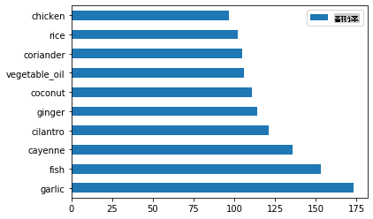
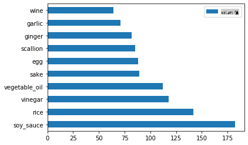
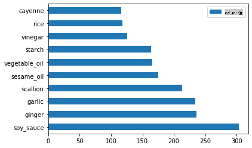
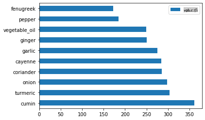
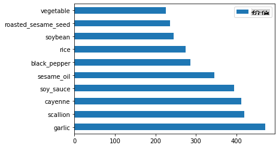

# 分类简介

在这四节课中，你将探索经典机器学习的一个基本重点——_分类_。我们将使用关于亚洲和印度所有美味菜肴的数据集，演示如何使用各种分类算法。希望你已经准备好享受这场美食盛宴了！


> 在这些课程中庆祝泛亚洲美食吧！图片由 [Jen Looper](https://twitter.com/jenlooper) 提供

分类是一种[监督学习](https://wikipedia.org/wiki/Supervised_learning)形式，它与回归技术有很多相似之处。如果说机器学习的全部内容是通过使用数据集来预测值或事物的名称，那么分类通常分为两类：_二元分类_和_多类分类_。

[](https://youtu.be/eg8DJYwdMyg "Introduction to classification")

> 🎥 点击上面的图片观看视频：MIT的John Guttag介绍分类

记住：

- **线性回归**帮助你预测变量之间的关系，并准确预测新数据点相对于这条线的位置。因此，你可以预测_南瓜在九月和十二月的价格_。
- **逻辑回归**帮助你发现“二元类别”：在这个价格点上，_这个南瓜是橙色的还是非橙色的_？

分类使用各种算法来确定数据点的标签或类别的其他方式。让我们使用这个美食数据，看看通过观察一组配料，是否可以确定它的来源美食。

## [课前测验](https://gray-sand-07a10f403.1.azurestaticapps.net/quiz/19/)

> ### [本课程有R语言版本！](../../../../4-Classification/1-Introduction/solution/R/lesson_10.html)

### 介绍

分类是机器学习研究人员和数据科学家的基本活动之一。从对二元值的基本分类（“这封邮件是垃圾邮件还是不是？”），到使用计算机视觉进行复杂的图像分类和分割，能够将数据分类并对其提问总是很有用的。

以更科学的方式陈述这个过程，你的分类方法创建了一个预测模型，使你能够将输入变量与输出变量之间的关系映射出来。


> 分类算法处理的二元与多类问题。信息图由 [Jen Looper](https://twitter.com/jenlooper) 提供

在开始清理数据、可视化数据并为我们的机器学习任务做准备之前，让我们先了解一下机器学习分类数据的各种方式。

分类源自[统计学](https://wikipedia.org/wiki/Statistical_classification)，使用经典机器学习进行分类使用特征，例如`smoker`, `weight`, 和`age`来确定_患X疾病的可能性_。作为一种类似于你之前执行的回归练习的监督学习技术，你的数据是有标签的，机器学习算法使用这些标签来分类和预测数据集的类别（或“特征”）并将其分配到一个组或结果中。

✅ 想象一下关于美食的数据集。一个多类模型能够回答什么问题？一个二元模型能够回答什么问题？如果你想确定某种美食是否可能使用葫芦巴怎么办？如果你想知道，如果得到一袋满是八角、洋蓟、花椰菜和辣根的杂货，你能否做出一道典型的印度菜？

[](https://youtu.be/GuTeDbaNoEU "Crazy mystery baskets")

> 🎥 点击上面的图片观看视频。节目“Chopped”的整个前提是“神秘篮子”，厨师们必须用随机选择的配料做出一些菜肴。肯定有一个机器学习模型会有所帮助！

## 你好，'分类器'

我们想要向这个美食数据集提出的问题实际上是一个**多类问题**，因为我们有几个潜在的国家美食可以处理。给定一批配料，这些数据将适合哪些类别？

Scikit-learn提供了几种不同的算法来分类数据，具体取决于你要解决的问题类型。在接下来的两节课中，你将学习这些算法中的几种。

## 练习 - 清理和平衡你的数据

在开始这个项目之前的第一个任务是清理和**平衡**你的数据，以获得更好的结果。从这个文件夹根目录中的空白_notebook.ipynb_文件开始。

首先要安装的是[imblearn](https://imbalanced-learn.org/stable/)。这是一个Scikit-learn包，它将允许你更好地平衡数据（你将在稍后了解更多关于此任务的内容）。

1. 要安装`imblearn`，运行`pip install`，如下所示：

    ```python
    pip install imblearn
    ```

1. 导入需要的包以导入数据并可视化它，还要从`imblearn`中导入`SMOTE`。

    ```python
    import pandas as pd
    import matplotlib.pyplot as plt
    import matplotlib as mpl
    import numpy as np
    from imblearn.over_sampling import SMOTE
    ```

    现在你已设置好读取导入数据。

1. 下一个任务是导入数据：

    ```python
    df  = pd.read_csv('../data/cuisines.csv')
    ```

   使用`read_csv()` will read the content of the csv file _cusines.csv_ and place it in the variable `df`。

1. 检查数据的形状：

    ```python
    df.head()
    ```

   前五行看起来像这样：

    ```output
    |     | Unnamed: 0 | cuisine | almond | angelica | anise | anise_seed | apple | apple_brandy | apricot | armagnac | ... | whiskey | white_bread | white_wine | whole_grain_wheat_flour | wine | wood | yam | yeast | yogurt | zucchini |
    | --- | ---------- | ------- | ------ | -------- | ----- | ---------- | ----- | ------------ | ------- | -------- | --- | ------- | ----------- | ---------- | ----------------------- | ---- | ---- | --- | ----- | ------ | -------- |
    | 0   | 65         | indian  | 0      | 0        | 0     | 0          | 0     | 0            | 0       | 0        | ... | 0       | 0           | 0          | 0                       | 0    | 0    | 0   | 0     | 0      | 0        |
    | 1   | 66         | indian  | 1      | 0        | 0     | 0          | 0     | 0            | 0       | 0        | ... | 0       | 0           | 0          | 0                       | 0    | 0    | 0   | 0     | 0      | 0        |
    | 2   | 67         | indian  | 0      | 0        | 0     | 0          | 0     | 0            | 0       | 0        | ... | 0       | 0           | 0          | 0                       | 0    | 0    | 0   | 0     | 0      | 0        |
    | 3   | 68         | indian  | 0      | 0        | 0     | 0          | 0     | 0            | 0       | 0        | ... | 0       | 0           | 0          | 0                       | 0    | 0    | 0   | 0     | 0      | 0        |
    | 4   | 69         | indian  | 0      | 0        | 0     | 0          | 0     | 0            | 0       | 0        | ... | 0       | 0           | 0          | 0                       | 0    | 0    | 0   | 0     | 1      | 0        |
    ```

1. 通过调用`info()`获取有关此数据的信息：

    ```python
    df.info()
    ```

    你的输出类似于：

    ```output
    <class 'pandas.core.frame.DataFrame'>
    RangeIndex: 2448 entries, 0 to 2447
    Columns: 385 entries, Unnamed: 0 to zucchini
    dtypes: int64(384), object(1)
    memory usage: 7.2+ MB
    ```

## 练习 - 了解美食

现在工作开始变得更有趣了。让我们发现每种美食的数据分布

1. 通过调用`barh()`将数据绘制为条形图：

    ```python
    df.cuisine.value_counts().plot.barh()
    ```

    

    有有限数量的美食，但数据分布不均。你可以修复它！在这样做之前，多探索一下。

1. 找出每种美食有多少数据并打印出来：

    ```python
    thai_df = df[(df.cuisine == "thai")]
    japanese_df = df[(df.cuisine == "japanese")]
    chinese_df = df[(df.cuisine == "chinese")]
    indian_df = df[(df.cuisine == "indian")]
    korean_df = df[(df.cuisine == "korean")]
    
    print(f'thai df: {thai_df.shape}')
    print(f'japanese df: {japanese_df.shape}')
    print(f'chinese df: {chinese_df.shape}')
    print(f'indian df: {indian_df.shape}')
    print(f'korean df: {korean_df.shape}')
    ```

    输出如下所示：

    ```output
    thai df: (289, 385)
    japanese df: (320, 385)
    chinese df: (442, 385)
    indian df: (598, 385)
    korean df: (799, 385)
    ```

## 发现配料

现在你可以深入挖掘数据，了解每种美食的典型配料。你应该清理会在美食之间造成混淆的重复数据，所以让我们了解这个问题。

1. 在Python中创建一个函数`create_ingredient()`来创建一个配料数据框。这个函数将首先删除一个无用的列，并按其计数对配料进行排序：

    ```python
    def create_ingredient_df(df):
        ingredient_df = df.T.drop(['cuisine','Unnamed: 0']).sum(axis=1).to_frame('value')
        ingredient_df = ingredient_df[(ingredient_df.T != 0).any()]
        ingredient_df = ingredient_df.sort_values(by='value', ascending=False,
        inplace=False)
        return ingredient_df
    ```

   现在你可以使用该函数了解每种美食最受欢迎的前十种配料。

1. 调用`create_ingredient()` and plot it calling `barh()`：

    ```python
    thai_ingredient_df = create_ingredient_df(thai_df)
    thai_ingredient_df.head(10).plot.barh()
    ```

    

1. 对日本数据做同样的操作：

    ```python
    japanese_ingredient_df = create_ingredient_df(japanese_df)
    japanese_ingredient_df.head(10).plot.barh()
    ```

    

1. 现在是中国配料：

    ```python
    chinese_ingredient_df = create_ingredient_df(chinese_df)
    chinese_ingredient_df.head(10).plot.barh()
    ```

    

1. 绘制印度配料：

    ```python
    indian_ingredient_df = create_ingredient_df(indian_df)
    indian_ingredient_df.head(10).plot.barh()
    ```

    

1. 最后，绘制韩国配料：

    ```python
    korean_ingredient_df = create_ingredient_df(korean_df)
    korean_ingredient_df.head(10).plot.barh()
    ```

    

1. 现在，通过调用`drop()`删除在不同美食之间造成混淆的最常见配料：

   每个人都喜欢大米、大蒜和姜！

    ```python
    feature_df= df.drop(['cuisine','Unnamed: 0','rice','garlic','ginger'], axis=1)
    labels_df = df.cuisine #.unique()
    feature_df.head()
    ```

## 平衡数据集

现在你已经清理了数据，使用[SMOTE](https://imbalanced-learn.org/dev/references/generated/imblearn.over_sampling.SMOTE.html) - “合成少数过采样技术” - 来平衡它。

1. 调用`fit_resample()`，这种策略通过插值生成新样本。

    ```python
    oversample = SMOTE()
    transformed_feature_df, transformed_label_df = oversample.fit_resample(feature_df, labels_df)
    ```

    通过平衡你的数据，当分类它时你将获得更好的结果。想想一个二元分类。如果你大部分数据都是一个类别的，机器学习模型会更频繁地预测该类别，仅仅因为它有更多的数据。平衡数据会修正任何倾斜的数据，并有助于消除这种不平衡。

1. 现在你可以检查每种配料的标签数量：

    ```python
    print(f'new label count: {transformed_label_df.value_counts()}')
    print(f'old label count: {df.cuisine.value_counts()}')
    ```

    你的输出如下所示：

    ```output
    new label count: korean      799
    chinese     799
    indian      799
    japanese    799
    thai        799
    Name: cuisine, dtype: int64
    old label count: korean      799
    indian      598
    chinese     442
    japanese    320
    thai        289
    Name: cuisine, dtype: int64
    ```

    数据干净、平衡，非常美味！

1. 最后一步是将你的平衡数据，包括标签和特征，保存到一个可以导出到文件的新数据框中：

    ```python
    transformed_df = pd.concat([transformed_label_df,transformed_feature_df],axis=1, join='outer')
    ```

1. 你可以使用`transformed_df.head()` and `transformed_df.info()`再看一遍数据。保存这个数据的副本以供将来课程使用：

    ```python
    transformed_df.head()
    transformed_df.info()
    transformed_df.to_csv("../data/cleaned_cuisines.csv")
    ```

    这个新的CSV现在可以在根数据文件夹中找到。

---

## 🚀挑战

这个课程包含几个有趣的数据集。浏览`data`文件夹，看看是否有适合二元或多类分类的数据集？你会向这个数据集提出什么问题？

## [课后测验](https://gray-sand-07a10f403.1.azurestaticapps.net/quiz/20/)

## 复习与自学

探索SMOTE的API。它最适用于哪些用例？它解决了哪些问题？

## 作业

[探索分类方法](assignment.md)

**免责声明**：
本文档使用基于机器的AI翻译服务进行翻译。虽然我们努力确保准确性，但请注意，自动翻译可能包含错误或不准确之处。应将原始语言的文档视为权威来源。对于关键信息，建议使用专业人工翻译。对于因使用本翻译而产生的任何误解或误读，我们不承担任何责任。